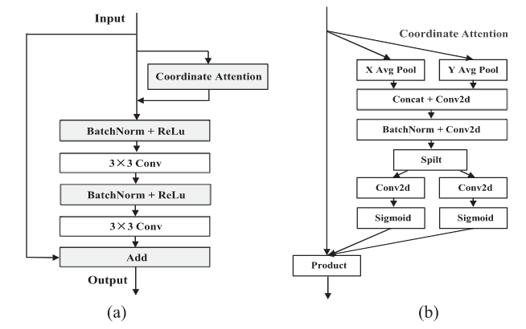
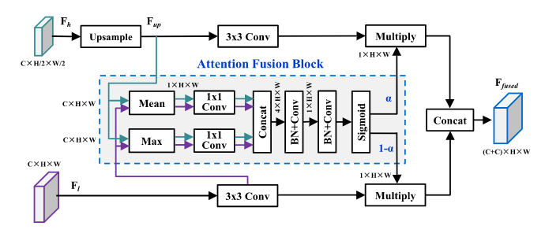
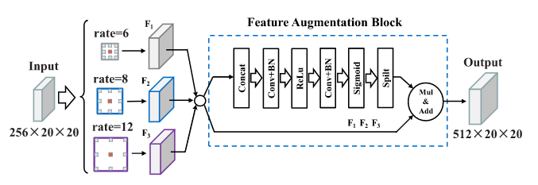

## AAGDN: Attention-Augmented Grasp Detection Network Based on Coordinate Attention and Effective Feature Fusion Method

> Published 1 June 2023 · Computer Science · IEEE Robotics and Automation Letters
>
> [IEEE](https://ieeexplore.ieee.org/document/10105990)
>
> Github

#### Abstract
High-precision robotic grasping is necessary for extensive grasping applications in the future. Most previous grasp detection methods fail to pay enough attention to learn grasp-related features and the detection accuracy is limited. In this letter, a novel attention-augmented grasp detection network (AAGDN) is presented to generate accurate grasp poses for unknown objects. The proposed AAGDN has three elaborate designs making it achieve higher accuracy than existing methods. First, we construct a coordinate attention residual module to extract positional information and improve the spatial sensitivity of features. Then, we proposean effective feature fusion module to bridge the resolution and semantic gaps of different-level features and obtain efficient featurere presentations. Lastly, a feature augmentation pyramid module is developed to enhance grasp-related features as needed and reducethe loss of information. Extensive experiments on three public datasets and various real-world scenes prove that the proposed AAGDN achieves better performance than current methods. Ourmodel obtains the state-of-the-art 99.3% and 96.2% grasp detec-tion accuracy on the Cornell and Jacquard dataset, respectively.Moreover, in physical grasping experiments, the AAGDN attains the 94.6% success rate for unseen objects in cluttered scenes, which further demonstrates the accuracy and robustness of our method to grasp novel objects.

#### Introduction
...
To overcome these problems, we propose the AAGDN. First,we construct the CoA-ResNet to extract positional information and enhance spatial sensitivity of features.Second, we propose an Effective Feature Fusion Module (EFFM) to weight the importance of different level features at each pixel when fusing them. Third, we develop the Feature Augmentation Pyramidal Module (FAPM) to enhance significant grasp-related features that are perhaps ignored and lost with the deepening of the network. The proposed AAGDN outperforms the latest methods and behaves competitive to the state-of-the-art. We visualize the comparison results, investigate the specific effectiveness of proposed modules, and conduct ablation studies.Finally, extensive grasping experiments are performed for various objects,including household, 3D-printed and metal objects.

为了克服这些问题，我们提出了AAGDN。**首先，我们构建了CoA-ResNet来提取位置信息并增强特征的空间敏感性。其次，我们提出了一个有效的特征融合模块（EFFM）来加权融合时每个像素上不同级别特征的重要性。第三，我们开发了特征增强金字塔模块（FAPM）来增强与抓握相关的可能随着网络的深入而被忽视和丢失的重要特征。** 所提出的AAGDN优于最新的方法，并且与最先进的方法相比具有竞争力。我们将比较结果可视化，研究所提出模块的具体有效性，并进行消融研究。最后，对各种物体进行了拉伸抓取实验，包括家用物体、3D打印物体和金属物体。

The contributions can be summarized in four folds:
1. We construct a novel coordinate attention residual module,which improves the grasping-position attention and spatialsensitivity of features, assisting the grasp model to moreaccurately locate the optimal grasp position.
我们构造了一个新的坐标注意力残差模块，提高了抓取位置的注意力和特征的空间敏感性，帮助抓取模型更准确地定位最优抓取位置。
2. An effective feature fusion module is proposed to conduct adaptive response of multi-level features when fusing them, which bridges the representation gaps of features and ensures efficient information propagation in the combination phase.
提出了一种有效的特征融合模块，在融合时对多层次特征进行自适应响应，弥合了特征的表示间隙，确保了信息在融合阶段的有效传播。
3. We develop a new feature augmentation pyramid module to enhance grasp-related features that may be neglected and lost during encoding and refine the grasp performance.
我们开发了一种新的特征增强金字塔模块，以增强在编码过程中可能被忽略和丢失的抓取相关特征，并改进抓取性能。
4. The grasp network AAGDN with our proposed modules achieves the state-of-the-art performance on public datasets and real-world robotic grasping experiments.
抓取网络AAGDN和我们提出的模块在公共数据集和真实世界的机器人抓取实验上实现了最先进的性能。

#### Method
##### A. Network Architecture
The overall network architecture of AAGDN is shown inFig.1, which is mainly composed of the CoA-ResNet, EFFM and FAPM.The grasp detection network takes a 4-channel imageas input and generates pixel-wise grasp poses by grasp quality,angle and width heatmaps. Firstly, given the input RGB-D imagewith the size of 4×320×320, we feed it into the encoder to gradually extract semantic information and encode it into high-level features to generate heatmaps, where the semantic information refers to the valuable features contained in the image and the information that they reflect about the properties the object to be grasped.Afterwards, we send the extracted features into the FAPM to reduce the loss of features and enhance important features. Then, the decoder with the EFFM is employed to fuse multi-level features and produce grasp configurations for every pixel. EFFM consists of two inputs: the output $F_{high}$ of the previous layer and the feature $F_{low}$ that have the same number channels from encoder. Each EFFM is followed by a residual block to decrease the channels. One convolution layer with the kernel scale of 1×1 is added after the whole upsampling process. The final network layer contains 4 task-specific convolutional filters $(f_{conv}^q, f_{conv}^{\cos(2\theta)}, f_{conv}^{\sin(2\theta)}, f_{conv}^w)$ with the kernel size of 3×3...

AAGDN的整体网络架构如图所示，主要由CoA-ResNet、EFFM和FAPM组成。抓取检测网络以4通道图像为输入，通过抓取质量、角度和宽度热图生成逐像素抓取姿态。首先，给定大小为4×320×320的输入RGB-D图像，我们将其输入编码器，以逐步提取语义信息，并将其编码为高级特征以生成热图，其中语义信息指的是图像中包含的有价值特征以及它们反映的关于待掌握对象属性的信息。然后，我们将提取的特征发送到FAPM，以减少特征的丢失并增强重要特征。然后，使用具有EFFM的解码器来融合多层次特征，并产生每个像素的抓取配置。EFFM由两个输入组成：上一层的高维特征和来自编码器的具有相同通道数的低维特征。每个EFFM后面跟着一个残差块以减少通道。在整个上采样过程之后，增加了一个核尺度为1×1的卷积层。最终的网络层包含4个特定于任务的卷积滤波器。

##### B. CoA-ResNet: Coordinate Attention Residual Network
existing studies only consider reweighing the importance of each channel but the rich position information in each channel is generally neglected. To address this problem, we propose to introduce the coordinate attention to this task and construct the **CoA-ResNet** to extract effective position information and generate attention weights, which reflect the importance of the corresponding position in featuremaps. This approach can enhance the spatial expressive ability of the learned features and help our model more accurately locate the optimal grasp position.

现有的研究只考虑了每个通道的重要性，但通常忽略了每个通道中丰富的位置信息。为了解决这个问题，我们建议将**坐标注意力**引入到该任务中，并构建CoA-ResNet来提取有效的位置信息并生成注意力权重，这反映了特征图中相应位置的重要性。这种方法可以提高学习特征的空间表达能力，并帮助我们的模型更准确地定位最佳抓握位置。

Fig.2(a) illustrates the structure of CoA-ResNet. The first component of CoA-ResNet is the coordinate attention block.The second part is a full pre-activation residual unit suggested in *""* . The detailed structure of coordinate attention block is givenin Fig.2(b), which contains two stages: coordinate information embedding and generation. By these two stages, we encodethe position information of the image into the feature maps to enhance the grasping position attention and spatial sensitivity of features so that the feasible grasp regions can be accurately highlighted. Concretely, given the input feature X, two pooling kernels are first employed to encode features along the horizontal and vertical coordinates, which yields a pair of direction-aware feature maps. The feature map at c-th channel with the vertical coordinate h is as follows:
$$
z_c^h(h) = \frac{1}{W} \sum_{0 \le i \lt W} x_c(h,i)
$$

Similarly, the feature map at c-th channel with the horizontal coordinate w is written as:
$$
z_c^w(w) = \frac{1}{H} \sum_{0 \le j \lt H} x_c(w,i)
$$

图2（a）显示了CoA ResNet的结构。CoA-ResNet的第一个组成部分是坐标注意力块。第二部分是提出的全预激活残差单元。坐标注意力块的详细结构如图2（b）所示，它包括两个阶段：坐标信息嵌入和生成。通过这两个阶段，我们将图像的位置信息编码到特征图中，以提高特征的抓取位置注意力和空间敏感性，从而准确地突出可行的抓取区域。具体地说，给定输入特征X，首先使用两个池化核来编码水平面垂直坐标上的特征，这产生了一对方向感知特征图。

With aggregated position information, the feature maps $z_c^h(h)$ and $z_c^w(w)$ are concatenated and then fed into a shared 1×1 convolution for coordinate attention generation. Then, we spilt the intermediate feature map $f$ along the spatial direction into two tensors $f^w$ and $f^h$，and another two 1×1 convolutions $F_h$ and $F_w$ are applied to separately transform $f^w$ and $f^h$ to tensors with the same channel numbers as input X:
$$
g^i = \sigma(F_i(f^i)),i = h,w
$$

where $σ$ denotes the sigmoid function.
Finally, the direction-aware tensor $g^i$ is expanded and the output feature $Y$ of coordinate attention block can be denoted as:
$$
y_c(i,j) = x_c(i,j) \times g_c^h(i) \times g_c^w(j)
$$

利用聚合的位置信息，将特征映射 $z_c^h(h)$ 和 $z_c^w(w)$ 连接起来，然后输入到共享的1×1卷积中，用于坐标注意力生成。然后我们将中间特征沿着空间方向映射为两个张量 $f^w$ 和 $f^h$，另外两个1x1的卷积 $F_h$ 和 $F_w$将$f^w$ 和 $f^h$分别变换为与输入X具有相同通道数的张量。

##### C. Effective Feature Fusion Module

The detailed structure of the proposed EFFM is illustrated in Fig.3. Given the feature maps $F_{high}$ and $F_{low}$ , we first adopt bilinear interpolation for upsampling $F_{high}$ to the same size as $F_{low}$. Afterwards, we utilize the channel-wise mean and maximum pooling to aggregate information, and two 1×1 refining convolutions are employed to encode the aggregated features. Then, the output four feature maps are concatenated together and fed into two 7×7 convolutional layers (with BN) followed by a sigmoid function to predict the fusion weight map $α ∈ R^{1×H×W}$, where each element represents the importance of the corresponding pixel in feature maps contributing to thefinal information propagation. In this case, the attention fusionblock can focus on the pixels that contain important semantic information in the high-level features and critical spatial detail information in the low-level features.The formulation of theattention fusion block can be depicted as:
$$
F_{cat} = Concat(Mean(F_{up}), Max(F_{up}), Mean(F_{low}), Max(F_{low})) \\
\alpha = Sigmod(Conv(F_{cat}))
$$

EFFM的详细结构如图所示。给定特征图 $F_{high}$ 和 $F_{low}$，我们首先采用双线性插值将 $F_{high}$ 上采样到与 $F_{low}$ 相同的大小。然后，我们利用信道平均和最大池来聚合信息，并使用两个1×1定义卷积来对聚合的特征进行编码。然后，输出的四个特征图被连接在一起，并被馈送到两个7×7卷积层（具有BN）中，然后用Sigmod函数来预测融合权重图 $α ∈ R^{1×H×W}$，其中每个元素表示特征图中对应像素对最终信息传播的重要性。

With the generated two weight maps, we further employ theelement-wise product between fusion masks and the input fea-ture maps. Finally, we perform concatenation for the attention-weighted features and outputs the fused feature:
$$
F_{fused} = Concat(f_{bilinear-interpolation}(F_{up}) \cdot \alpha, F_{low} \cdot (1 - \alpha))
$$

利用生成的两个权重图，我们进一步使用融合掩码和输入特征图之间的逐元素乘积。最后，我们对注意力加权特征进行串联并输出融合的特征。

Comparedtopriormethods,theEFFMappliestheweightmapfor different-level features to focus on the most relevant features,which bridges the representation gaps when fusing them andenables effective information propagation.

##### D. Feature Augmentation Pyramidal Module
As illustrated in Fig.4, the input feature is first fed to three parallel atrous convolutions with different rates.Then, these extracted multi-scale features are fed into the feature augmentation block to generate weights for each input.Specifically, we use concatenation, convolution and activation functions for these features and then effectively aggregate them to the output by calculating the weighted sum. In this letter, we adopt the 3×3 atrous convolution with rate parameters from[6],[12],[18]to generate the multi-scale context information. With the FAPM, we ensure the integrity of spatial and contextual information,reduce the loss of detailed features and enhance grasp-related information.

如图4所示，输入特征首先被馈送到具有不同速率的三个并行空洞卷积。然后，将这些提取的多尺度特征输入到特征增强块中，以生成每个输入的权重。具体来说，我们对这些特征使用级联、卷积和激活函数，然后通过计算加权和将它们有效地聚合到输出中。在本文中，我们采用了6 8 12的3×3的空洞卷积来生成多尺度上下文信息。通过FAPM，我们确保了空间和上下文信息的完整性，减少了细节特征的丢失，并增强了对相关信息的把握。

