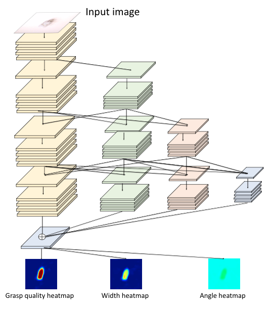
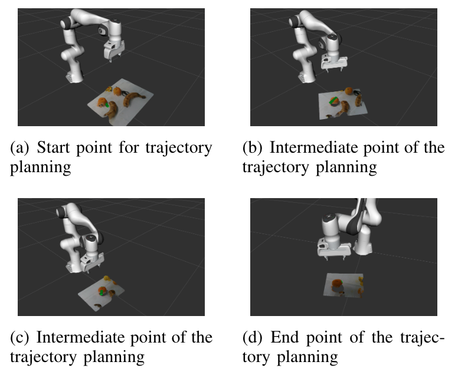

## A Robotic Visual Grasping Design: Rethinking Convolution Neural Network with High-Resolutions

> Published 15 September 2022 · Computer Science · ArXiv
>
> [ArXiv](https://arxiv.org/abs/2209.07459)
>
> [Github]()

#### Abstract
High-resolution representations are important for vision-based robotic grasping problems. Existing works generally encode the input images into low-resolution representations via sub-networks and then recover high-resolution representations. This will lose spatial information, and errors introduced by the decoder will be more serious when multiple types of objects are considered or objects are far away from the camera. To address these issues, we revisit the design paradigm of CNN for robotic perception tasks. We demonstrate that using parallel branches as opposed to serial stacked convolutional layers will be a more powerful design for robotic visual grasping tasks. In particular, guidelines of neural network design are provided for robotic perception tasks, e.g., high-resolution representation and lightweight design, which respond to the challenges in different manipulation scenarios. We then develop a novel grasping visual architecture referred to as HRG-Net, a parallel-branch structure that always maintains a high-resolution representation and repeatedly exchanges information across resolutions. Extensive experiments validate that these two designs can effectively enhance the accuracy of visual-based grasping and accelerate network training. 
#### Introduction
In this work, we focus on retaining the details of the representation. Previous approaches mainly used encoder and decoder structures, and U-Net like networks can extract features well and contain rich semantics. However, spatial information can lose when recovering high-resolution representations from the encoded low-resolution representations,resulting in inappropriate predictions and failure of grasping tasks. As shown in Fig. 1, the workspace is cluttered with various objects. When approaching to the target object, the claw touches an adjacent object and thus fails in grasping the target object. To address this issue, we present a novel neural network design paradigm for robotic visual grasping as shown in Fig. 2.**It is a parallel-branch structure that maintains a high-resolution representation and repeatedly exchanges information across resolutions**. The model not only reaches the state-of-the-art results on several mainstream datasets (99.5% in Cornell and 96.5% in Jacquard ), but also perform well in various grasping-related applications in physical environments. To unravel the role of components in our model, the ablation experiments are performed. **It is also found that high resolutionis crucial for robotic perception tasks**. Our insight is that the model should more focus on the configuration information, e.g., object position, shape, etc, so that stronger perception can be obtained to facilitate robotic grasping. 

在这项工作中，我们专注于保留表示的细节。以前的方法主要使用编码器和编码器结构，类似U-Net的网络可以很好地提取特征并包含丰富的语义。然而，当从编码的低分辨率表示中恢复高分辨率表示时，空间信息可能会丢失，导致不适当的预测和抓取任务的失败。工作空间里堆满了各种各样的物体。当接近目标物体时，夹爪接触到相邻物体，从而无法抓住目标物体。为了解决这个问题，我们提出了一种用于机器人视觉抓取的新型神经网络设计范式，如图所示，它是一种并行分支结构，可以保持高分辨率的表示，并在解决方案之间重复交换信息。为了阐明组件在我们的模型中的作用，进行了消融实验。研究还发现，高分辨率对于机器人感知任务至关重要。我们的见解是，该模型应该更多地关注配置信息，例如，物体的位置、形状等，通过获得更强的感知能力以便于机器人抓取。

The main contribution of this paper can be summarised as follows:
1. To the best of our knowledge, it is one of the first attempts to explore the high-resolution feature map for improved perception quality in robotic visual grasping.
2. We develop an online closed-loop robotic grasping framework that dynamically adjusts the motion of the end-effector based on real-time visual detection.
3. Extensive comparison results and physical experiments show the advantages of maintaining high-resolution featuresin the robotic perception framework.

1. 据我们所知，这是探索高分辨率特征图以提高机器人视觉抓取感知质量的首次尝试之一。
2. 我们开发了一种在线闭环机器人抓取框架，该框架基于实时视觉检测动态调整末端执行器的运动。
3. 广泛的比较结果和物理实验显示了在机器人感知框架中保持高分辨率特征的优势。

#### Backgroud and Problem Formulation
##### B. Problem Formulation
Given some labeled dataset (Cornell or Jacquard, etc.), select $N$ samples $(x_1,x_2,...,x_N),x_i ∈ \mathbb R^{H × W}$, $H$ and $W$ are the height and width of the image, respectively. The objective of visual net is about how to construct a neural network $\cal F$ with parameters $Θ$ to ensure that the loss function is minimized after $Θ$ certain number of updates.The loss function is:
$$
L(\Theta) = \frac{1}{2N} \sum_{i}^{N}(\cal F(x_i, \Theta) - y_i)^2
$$

where $y_i$ is label corresponding image $x_i$.
After obtaining the perception module, the next objectiveis to integrate it into the motion planning to online adjust manipulation trajectories to accomplish grasping tasks.

#### HRG-NET Based Grasping Framework
##### A. Motivation
Feature extraction plays a crucial role in robotic visual grasping. One early approach applied hand-crafted features to extract the grasping candidates, and then used methods of deep learning to stack convolutional layers and build abstract feature representation. Unlike the general supervised vision tasks that often demand refined semantic information such asobject category features, grasping models pay more attentionto fine-grained geometric features such as series of edgesand the shape of an object to facilitate grasping. Existing mainstream works generally encode the input image into a low-resolution representation through a subnetwork and then decode the high-resolution representation from it. But in practice, we realized that such a common visual strategy can not help the robot accurately predict gripping configurations when the object is far away from the camera or multiple objects are stacked together. As analyzed in Mask-RCNN, this downside is caused by upsampling the feature map that istoo small. Inspired by "Deep high-resolution representation learning for human pose estimation","Deep high-resolution representation learningfor visual recognition", **we aim at maintaining a high-resolution feature map throughout the overall visual process to avoid loss of spatial accuracy**. Such an application is not trivial since we need to consider robotic practical situations and bridge gap of sim-to-real.

不像一般的监督视觉任务通常需要细化语义信息（如对象类别特征），抓取模型更关注细粒度的几何特征，如边缘序列和对象形状，以便于抓取。现有主流工作通常通过子网络将输入图像编码为低分辨率表示，然后从中解码高分辨率表示。但在实践中，我们意识到，当物体远离相机或多个物体堆叠在一起时，这种常见的视觉策略无法帮助机器人准确预测抓取配置。正如Mask RCNN中所分析的，这种缺点是由于对太小的特征图进行了上采样造成的。受的启发，我们的目标是在整个视觉过程中保持高分辨率的特征图，以避免空间精度的损失。这样的应用并非微不足道，因为我们需要考虑机器人的实际情况，并弥合模拟与现实之间的差距。

##### B. HRG-Net Architecture
We present a design that differs from prior encoder-decoder architectures for robotic perception. As shownin Fig. 2, The entire network framework can be divided into 4 stages. Each stage consists of parallel stacked block with different feature resolutions, and each block is a residual block.Information interaction between different blocks is carried out via FuseLayer, where features are transitioned to the high-resolution branch by up-sampling operation and vice versa by down-sampling to the low-resolution branch. Concretely,the model utilizes a 3×3 convolution kernel with stride 2 to decrease the feature map resolution and a bilinear interpolation to perform up-sampling. The high-resolution representation fusion is obtained by parallelly mixing different resolution convolutional layers. Consequently, our approach can preserve the high-resolution representation by parallelly connecting high-to-low resolution convolutions, and iteratively performing fusion operations between parallel blocks.

整个网络框架可以分为4个阶段。每个阶段由具有不同特征分辨率的平行堆叠块组成，每个块是残差块。不同区块之间的信息交互是通过FuseLayer实现的，其中特征通过上采样操作转换到高分辨率分支，反之亦然，通过下采样转换到低分辨率分支。具体地说，该模型利用大小为3×3步长为2的卷积核来降低特征图的分辨率，并使用双线性插值来执行上采样。高分辨率表示融合是通过并行混合不同分辨率的卷积层来获得的。因此，我们的方法可以通过并行连接高分辨率到低分辨率卷积，并在并行块之间迭代执行融合操作，来保持高分辨率表示。

The main characteristics of our model are i) parallel connections from high-resolution to low-resolution throughout all phases of the model, and ii) exchanges of information across different resolutions to enrich semantic information. Technically, the network first starts with a convolutional stem block, gradually stacks convolutional blocks with different resolutions,and connects them in parallel. In general, the features learned by HRG-Net are both semantically and spatially strong. This is because the convolutional blocks of different resolutions are linked in parallel rather than serially, which is more beneficial for learning accurate spatial position information. And our model consistently maintains a high-resolution featurere presentation, instead of shrinking the feature maps as intraditional encoders. In addition, there is an ongoing fusion of information among the different branches, making a wealth of information at the semantic level.

##### C. Vision-based Trajectory Planning
Initial visual predictions with far distance to complex objects is crucial for the overall grasping task. This section introduces a trajectory planning framework by leveraging HRG-Net that has better performance regarding this point. First, it is worth noting that our entire gripping is a closed-loop process that adjusts trajectories of the manipulation’s end-effector in real-time using visual information from the cameraas feedback. It online captures input images as the end-effector moving close to the object vertically. Consequently, the choice of camera viewpoint plays an important role in the quality of visual detection. We apply an active perception technique to calculate the next best viewing angle in real time with an eye-in-hand camera.Before completing the grasping task, let $z_{max}$, $z_{obj}$ denote the heights of the initial end-effector and the predicted height of the object. We can have a trajectory $((p_0,p_1,...),p_i=(x,y,z)\in \mathbb R^3,(p_i[2]-p_j[2]\times)(i-j)\gt0)$ with decreasing heights (from $z_{max}$ to $z_{obj}$). During this process, the HRG-Net model is called when a new view-point is reached. Thus, we can obtain a series of predictions $((g_0,g_1,...),g_i=\cal F(camera(p_i), \Theta))$ from the trajectory points $(p_0,p_1,...)$, where $camera(p_i)$ is the image captured by the camera at $p_i$. Based on the direction of decreasing entropy of the grasping quality map $Q$, the robot arm then executes the horizontal trajectory planning and descends in height at a specific rate. Our trajectory planning method can effectively avoid clutter or occlusion situations owing to multi-view in trajectory.

与复杂物体相距较远的初始视觉预测对于整体抓取任务至关重要。本节介绍了一个利用HRG-Net的轨迹规划框架，该框架在这一点上具有更好的性能。首先，值得注意的是，我们的整个抓握是一个闭环过程，使用相机的视觉信息作为反馈实时调整操纵末端执行器的轨迹。它在线捕获输入图像作为末端效果或垂直靠近对象。因此，相机视点的选择对视觉检测的质量起着重要作用。我们应用主动感知技术，使用眼在手上的相机实时计算次佳视角。在完成抓握任务之前，用$z_{max}$、$z_{obj}$计算初始末端执行器的高度和物体的预测高度。随着高度的降低，我们可以有一个轨迹 $((p_0,p_1,...),p_i=(x,y,z)\in \mathbb R^3,(p_i[2]-p_j[2]\times)(i-j)\gt0)$ （从$z_{max}$到$z_{obj}$）。在这个过程中，当到达一个新的视点时，会调用HRG-Net模型。因此，我们可以得到来自轨迹点$(p_0,p_1,...)$一系列预测 $((g_0,g_1,...),g_i=\cal F(camera(p_i), \Theta))$，其中$camera(p_i)$是由 $camera$ 在 $p_i$ 处捕获的图像。基于抓取质量图 $Q$ 的熵递减方向，机器人手臂执行水平轨迹规划，并以特定的速率下降。我们的轨迹规划方法可以有效地避免由于轨迹中的多视图而导致的混乱或遮挡情况。

As a running example in Fig. 3, we can see that HRG-Net initially gives an inaccurate prediction (green solid rectangle) in Fig. 3 (a). At this point, the direct grasping based on offline motion planning may lead to a collision with the banana resulting the failure. By applying our method, as the end of the robot arm gradually approaches the workspace shown in Fig. 3 (b)-(c), the camera’s perspective decreases and the prediction will be more precise. Finally, when the height of the robotic manipulation’s end-effector does not reach the object i.e.,$z≥z_{obj}$ in Fig. 3 (d), HRG-Net gives a most reasonable prediction from previous perception information.

#### Conclusion
In this paper, we propose a framework of robotic visual grasping that maintains high-resolution representations and connects the high-to-low resolution convolution streams simultaneously. Our design is effective in boosting the performance of perception tasks by using parallel branches and fusing information between different resolutions rather than a single branch stacked convolutional layers. Physical experimental results including comparisons with the mainstream baselines show that HRG-Net delivers better performance for a large margin on several datasets. In conclusion, accurate spatial information integrated with motion planning plays an important role as rich semantic information, and HRG-Net can better address problems of the far distance between the initial camera and target. Future work will further explore cases where grasping objects are too small or the depth of information is not obvious.
