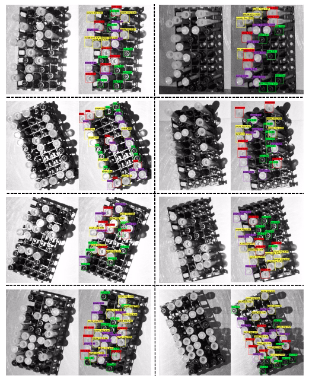
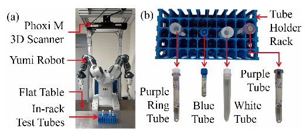
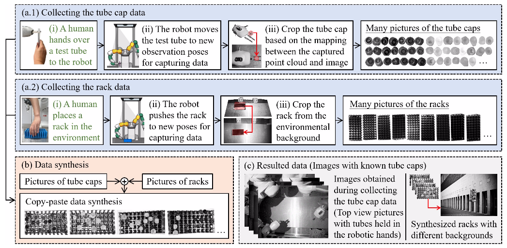
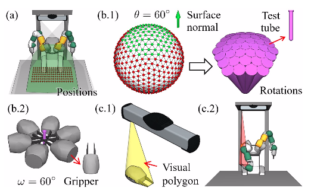
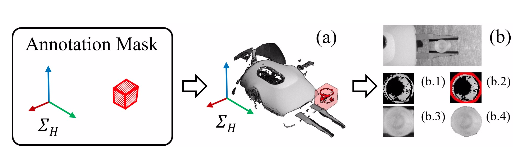
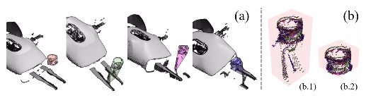
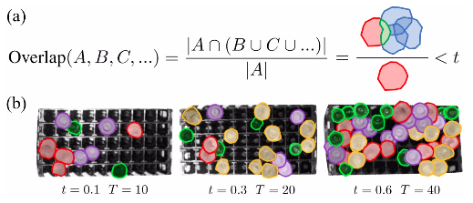

## Automatically Prepare Training Data for YOLO Using Robotic In-Hand Observation and Synthesis

> Published 4 January 2023 · Computer Science · ArXiv
>
> [ArXiv](https://arxiv.org/abs/2301.01441)
>
> [Github](https://github.com/wrslab/tubedet)

#### Abstract
Deep learning methods have recently exhibited impressive performance in object detection. However, such methods needed much training data to achieve high recognition accuracy,which was time-consuming and required considerable manual work like labeling images. In this paper, we automatically prepare training data using robots. Considering the low efficiency and high energy consumption in robot motion, we proposed combining robotic in-hand observation and data synthesis to enlarge the limited data set collected by the robot. **We first used a robot with a depth sensor to collect images of objects held in the robot’s hands and segment the object pictures. Then, we used a copy-paste method to synthesize the segmented objects with rack backgrounds. The collected and synthetic images are combined to train a deep detection neural network.** We conducted experiments to compare YOLOv5x detectors trained with images collected using the proposed method and several other methods. The results showed that combined observation and synthetic imagesled to comparable performance to manual data preparation. They provided a good guide on optimizing data configurations and parameter settings for training detectors. The proposed method required only a single process and was a low-cost way to produce the combined data. Interested readers may find the datasets and trained models from the following GitHub repository: https://github.com/wrslab/tubedet.

我们首先使用带有深度传感器的机器人来收集机器人手中物体的图像，并对物体图片进行分割。然后，我们使用复制粘贴方法来合成具有支架背景的分割对象。将采集的图像和合成的图像相结合送入深度检测神经网络进行训练。

#### Introduction
...
Previously, researchers have developed several methods to reduce data collection costs. For example, **data augmentation** enriched existing training data sets by applying random transformations like image rotation or scaling. **Data synthesis** generated previously unseen data using simulation or adversarial neural networks. The main challenge of the augmentation or synthesis methods was the “**domain gap**”: Augmented data had **less varied visual contexts**. Synthesized data was prone to **discrepancies with the real world**. Recently,researchers have revisited using **the copy-paste method** to increase data. The method was effective in compensating for the “domain gap” problem, exhibiting impressive performance.There is no clear boundary between augmentation and synthesis when using the copy-paste method to generate data. It was mainly classified as an synthesis method, although some studies considered it to be augmentation. This paper calls it a synthesis method to avoid confusion with transformation and scale-based data generation.

此前，研究人员已经开发了几种方法来降低数据收集成本。例如，数据扩充 通过应用随机变换（如图像旋转或缩放）来丰富现有的训练数据集。数据合成 使用模拟或对抗神经网络来生成以前没见过的数据。数据扩充或数据合成方法的主要挑战是“域间隙”。增强数据的视觉环境变化较小；合成数据很容易与现实世界产生差异。最近，研究人员再次使用**复制粘贴方法**来增加数据。该方法有效地补偿了“域间隙”问题，表现出了令人印象深刻的性能。当使用复制粘贴方法生成数据时，增强和合成之间没有明确的边界。它主要被归类为一种合成方法，尽管一些研究者认为它是一种增强方法。本文是把它作为一种合成方法，以避免与转换和基于规模的数据生成混淆。

Based on the current research status, this paper further delves into using robots to collect training data automatically.Considering the low efficiency and high energy consumptionin robotic data collection, we propose combining robotic observation and copy-paste synthesis to reduce costs. We assume a test tube detection task shown in Fig. 1 and use a robot with a depth sensor to move and observe tubes. The robot collects observation images and, at the same time, segments tubes from the images for copy-paste synthesis. The observation and synthetic images are used as training data for deep detection neural networks. Especially for the synthesis routine, we value the co-occurrence of tubes and racks, and paste tubes inside arack area to obtain contextual consistency. Also, we take into account factors like tube-to-tube occlusions and foreground changes caused by environment or visual difference to reduce unrealistic synthetic results. The proposed method helps enrich the data set and resolve the “domain gap”. It does not needheavy robotic effort.

基于目前的研究现状，本文进一步探讨了使用机器人自动采集训练数据。考虑到机器人数据采集的效率低、能耗高，我们建议将机器人观测和复制粘贴合成相结合，以降低成本。我们假设了如图所示的试管检测任务，并使用带有深度传感器的机器人来移动和观察试管。**机器人收集观测图像，同时从图像中分割试管，用于复制粘贴合成**。观测图像和合成图像被用作深度检测神经网络的训练数据。特别是**对于合成例程，我们评估试管和支架的共存，并将试管粘贴到支架区域内以获得上下文一致性。此外，我们还考虑了由环境或视觉差异引起的试管到试管的堵塞和前景变化等因素，以减少不真实的合成结果**。所提出的方法有助于丰富数据集并解决“域间隙”的问题。

In experiments, we trained several YOLOv5x networks to understand the performance of the proposed method. The training data was collected using the proposed and several other methods. **The results confirmed data collected using the proposed method do have claimed advantages. We also conducted multiple ablation studies to look into the impact of datavolumes and ratios when training detection neural networks using data collected with the proposed method. The results provided a good guide on optimizing data configurations and parameter settings for training detectors**.

The contributions of this work are as follows. (1) We develop an automatic data-collection method in which a robot holds target objects and observes them.The method yields observation images and target regions segmented from the images. (2) We develop a copy-paste image synthesis method to enrich the training data. The method pastes object regions on various rack backgrounds to balance “domain randomization”and “domain gap”. The rack backgrounds are also automatically collected by the robot. (3) We examined combinations of the observation and synthetic images and compared them with other data sets to understand the impact of data volume and ratios.

（1）我们开发了一种自动数据收集方法，在这种方法中，机器人可以探测目标物体并观察它们。该方法产生了观测图像和从图像中分割出的目标区域。
（2）我们开发了一种复制粘贴图像合成方法来丰富训练数据。该方法将对象区域粘贴在各种支架背景上，以平衡“域随机化”和“域间隙”。支架背景也由机器人自动收集。
（3）我们验证了观测图像和合成图像的组合，并将其与其他数据集进行了比较，以了解数据量和比率的影响。

#### Related Work
##### A. Automatic Data Collection Using Robots
Robot-based methods leverage actuated robots to simplify object segmentation. They can be traced back to early studies in object recognition and 3D object modeling.These work took advantages of robotic manipulation sequence to perceive objects from different viewpoints and segment the objects from the background. From the robotic manipulation perspective, such segmentation can be divided into two categories: In-hand object segmentation and Interaction-based segmentation.

基于机器人的方法利用驱动机器人来简化对象分割。它们可以追溯到物体识别和3D物体建模的早期研究。**这些工作利用机器人操作序列的优势，从不同的角度感知物体，并从背景中分割物体**。从机器人操作的角度来看，这种分割可以分为两类：**手上对象分割和基于交互的分割**。

**In-hand object segmentation**
More recent studies used deep learning to reduce the reliance on hand-crafted visual features for in-hand object segmentation. For instance, Florence et al. proposed a self-supervised framework to segment in-hand objects. The framework involved two steps that used the same training and learning routine. In the first step, the authors generated masks for the robot by considering combined depth and RGB information, and trained a neural network model based on the masks to differentiate the robot from the background. In the second step, the authors masked the grasped object and train neural network models to isolate the object from the robot hand. Boerdijk et al. used optical flow to respectively segment manipulators that were holding and not holding objects. The segmented data set were used to train a neural network for isolating manipulators and grasped objects.

最近的研究使用深度学习的方法来处理手上对象分割的问题从而减少对手工标注视觉特征的依赖。例如，Florence等人提出了一种自监督的框架来分割手上物体。该框架包括使用相同训练和学习程序的两个步骤。在第一步中，作者通过深度和RGB信息的组合来为机器人生成掩码，并训练了一个基于掩码的神经网络模型来区分机器人和背景。在第二步中，笔者对抓取的物体进行掩码处理，并训练神经网络模型以将物体与机械手分离。Boerdijk等人提出分别对抓取和不抓取物体的操纵器进行分割。分割后的数据集用于训练神经网络，用于隔离机械手和被抓取物体。

**Robot-object interaction**
On the other hand, some researchers took advantages of non-prehensile robot manipulation like push to change object perspectives and segment them based on robot motion cues.For example,Pathak et al. designed a framework to continuously refine a neural network model that generates object segmentation masks through robot interaction. The model initially generated hypothesis segmentation masks for objects. The masks were refined based on the pixel differences of the images captured before and after robotic interactions. The generating model was updated along with the refined masks. Singh et al. proposed to segment unknown objects in a cluttered scene while repeatedly using robotic nudge motions to interact with objects and induce geometric constraints. Robotic interactive segmentation often requires a static scene or surface to permit interaction between robots and objects. It is more complicated compared with the in-hand object segmentation as the object poses needs to be controlled and changed through robotic manipulation.

另一方面，一些研究人员利用不可抓握机器人的操作（如推）来改变物体视角，并根据机器人的运动线索进行分割。例如，Pathak等人设计了一个框架来不断完善神经网络模型，该模型通过机器人交互生成物体分割掩码。该模型最初为对象生成假设分割掩码，在根据机器人交互前后捕获图像的像素差异，对掩模进行了优化。生成的模型也会随着优化的掩码一起更新。Singh等人提出在杂乱的场景中分割未知物体，同时重复使用机器人轻推运动与物体交互并引入几何约束。机器人交互分割通常需要一个静态场景或表面来允许机器人和物体之间的交互。与手上物体分割相比，它更复杂，因为物体姿态需要通过机器人操作来控制和改变。

##### B. Data Augmentation and Synthesis
The copy-paste method is widely used for generating synthetic data. It segments foreground objects from existing images, possibly modifies them, and pastes them onto new backgrounds. The copy-paste method is easy to implement and shows notable performance over using pure real data.Previous studies showed that it was important to carefully select the backgrounds when pasting objects. For example, Divvala et al.experimentally showed visual context benefited object detection performance and reduced detection errors. Dvornik et al. showed that the correct visual context when pasting object can improve prediction performance while inappropriate visual context led to negative results. Wang et al. swapped objects of the same class in different images to ensure contextual consistency between objects and backgrounds and showed using the exsiting backgrounds had better performance than random ones. Also,the copy-paste method requires a data set containing many possible views of the object that are easy to be cut out. It is burden some for humans to prepare them.

复制粘贴方法被广泛用于生成合成数据。它将前景对象从现有图像中分割出来，可能会对其进行修改，并将其粘贴到新的背景上。复制粘贴方法易于实现，并且与使用单纯的真实数据相比显示出显著的性能。先前的研究表明，在粘贴对象时，选择背景是很重要的。例如，Divvala等人实验表明，可视化上下文信息有利于物体检测性能，并减少检测误差。Dvornik等人表明，粘贴对象时正确的视觉上下文可以提高预测性能，而不适当的视觉上下文会导致负面结果。Wang等人在不同的图像中交换同一类的对象，以确保对象和背景之间的上下文一致性，并表明使用现有的背景比随机背景具有更好的性能。此外，复制粘贴方法需要一个数据集，该数据集包含易于剪切的对象的许多可能视图。为它们做准备对人类来说是一件繁重的事。

Graphical simulation is another popular method for synthesizing training data. The benefits of simulation is that it allows freely changing light conditions and materials to increase variation. It also allows capturing many views of objects by simply transforming virtual camera poses. For example, Hodaˇnet al. and Richter et al. respectively used photo-realistic rendering to synthesize images of 3D object models and scenes. The methods required a lot of computational resources to narrow down the domain gap between syntheticand realistic data. Tobin et al. proposed the concept of domain randomization (DR). They randomized a simulator to expose models to a wide range of environments and obtainvaried training data. Instead of photo-realistic rendering, the method only required low-fidelity rendering results to reach satisfying accuracy for medium-size objects. Carlson et al. ,Hinterstoisser et al., Prakash et al., and Tremblayet al. respectively used DR to narrow down the domain gap. The authors randomly changed the context in simulation so that “the real data was made to be just like another simulation”. Yang et al. and Sundermeyer et al. respectively sampled viewpoints of 3D object models using simulation and mixed the samples with real backgrounds to reduce the human effort for preparing scenes with rich domain randomness.Besides DR, Generative Adversarial Networks(GANs) were also promising to reduce domain gap. For example, Chatterjee et al. designed a lightweight-GAN to synthesize data for training plastic bottle detectors.

图形模拟是合成训练数据大小的另一种流行方法。模拟的好处是，它允许自由改变光照条件和材料，以增加变化。它还允许通过简单地变换虚拟相机的姿势来捕捉物体的许多视图。例如，Hoda等人和Richter等人分别使用照片逼真度渲染来合成3D对象模型和场景的图像。这些方法需要大量的计算资源来缩小合成数据和现实数据之间的域间隙。Tobin等人提出了域随机化（DR）的概念。他们将模拟器随机分组，将模型暴露在各种环境中，并获得不同的训练数据。该方法不需要照片逼真的渲染，只需要低保真度的渲染结果就可以达到中等尺寸物体的满意精度。Carlson等人、Hinterstoisser等人、Prakash等人和Tremblayet等人分别使用DR来缩小域间隙。作者随机改变了模拟中的上下文，使“真实数据与其他模拟一样”。Yang等人和Sundermeyer等人分别使用模拟对3D对象模型的视点进行采样，并将样本与真实背景混合，以减少人类准备具有丰富域随机性的场景的工作量。除了DR，生成对抗性网络（GANs）也有望减少域间隙。例如，Chatterjee等人设计了一种轻量级的GAN来合成数据，用于训练塑料瓶探测器。

#### Robotsystem And Workflow
##### Configurations of the Robot System
A Photoneo Phoxi M 3D Scanner is used for capturing objects on the flat table. An ABB Yumi dual-arm robot with a two-finger gripper is used to manipulate objects in the system. A flat table is set up in the front of the Yumi robot. The in-rack test tubes to be recognized are placed on the surface. The Phoxi scanner is a structured-light based depth sensor. It can capture gray images and point clouds simultaneously. Each data point of a point cloud captured by the Phoxi scanner have a one-to-one correspondence to a pixel in a gray image. We can segment an object in the gray image by considering its point cloud.

Photoneo Phoxi M 3D扫描仪用于捕捉平板上的对象。ABB Yumi双臂机器人带有两个手指夹持器，用于操作系统中的物体。Yumi robot的前面放了一张平桌子，待识别的架内试管放置在表面上。Phoxi扫描仪是一种基于结构光的深度传感器。它可以同时捕捉灰色图像和点云信息。Phoxi扫描仪捕获的点云的每个数据点与灰度图像中的像素点一一对应。我们可以通过考虑灰色图像中的点云来分割对象。

Especially, we install the Phoxi scanner on top of the robot to obtain a top view of the racks and tubes. When recognizing tubes in the rack, we select the tube caps as the primary identifiers. There are two reasons why we prefer using the tube caps for identification. The first one is that obtaining the point cloud of a translucent or crystal test tube fails easil ydue to limitations of the structured-light based depth sensors.The second one is that the tube bodies are blocked by the caps and also occluded by surrounding tubes when placed in the rack and viewed from a top position. They are less visible. However, despite the reasons and their merits, there is a problem that different types of tubes may share a same cap type. In this work, we assume the test tubes with the same caps can be identified by their heights in the rack and analyze the point cloud to differentiate them.

特别是，我们将Phoxi扫描仪安装在机器人的顶部，以获得支架和试管的俯视图。识别支架中的试管时，我们选择试管盖作为主要标识符。我们选择使用试管盖进行识别有两个原因。第一种是，由于基于结构光的深度传感器的限制，获取半透明或晶体试管的点云很容易失败。第二种是，当将试管放置在支架中并从顶部观察时，试管主体被是试管盖阻挡，也被周围的试管阻挡，它们不太显眼。然而，尽管有其原因和优点，但仍存在不同类型的试管可能拥有相同的试管盖类型的问题。在这项工作中，我们假设具有相同盖子的试管可以通过它们在支架中的高度来识别，并分析点云来区分它们。

##### Workflow for Data Preparation
We prepare the training data using the robot system following the workflow shown in Fig. 3. **There are four dashed boxes in the chart, where (a.1) and (a.2) have a blue background color and represent the data collection component, (b) has an orange background color and represents the data synthesis component,(c) has a gray background and represents the resulted data**.

我们使用机器人系统按照图所示的工作流程准备训练数据。图表中有四个虚线框，其中（a.1）和（a.2）的背景颜色为蓝色，表示数据收集组件，（b）的背景色为橙色，表示数据合成组件，（c）的背景为灰色，表示结果数据。

The first blue dashed box (Fig. 3(a.1)) comprises three steps. First, a human hands over an unknown test tube to the robot.The tube is assumed to be grasped vertically by the robot after handover, with the tube cap left above the robotic fingertips.Second, the robot moves the test tube to the observation poses prepared offline while considering avoiding self-occlusions.The Phoxi sensor will capture the test tube’s gray image and point cloud at each observation pose. Third, the system segments the cap region out of the captured image based on a mapping from its counterpart point cloud. The segmentation result only includes the cap. The background will be removed thanks to the point cloud mapping. The output of this dashed box includes many cap region pictures. They are observed from different views and thus have different illumination and visual conditions.

第一个蓝色虚线框（图3（a.1））包括三个步骤。首先，人类将未知试管交给机器人。假设试管在移交后由机器人垂直抓握，试管盖留在机器人指尖上方。其次，机器人将试管移动到离线准备的观察姿势，同时考虑避免自我遮挡。Phoxi传感器将捕捉试管的灰色图像和每个观察姿势的点云。第三，系统根据对应点云的映射，从捕获的图像中分割出试管盖区域。分割结果仅包括试管盖。背景将根据点云映射被删除。输出结果包含许多试管盖的图片。它们是从不同的角度观察的，因此具有不同的照明和视觉条件。

The second blue dashed box (Fig. 3(a.2)) is similar to the first one and also comprises three steps. First, a person places a rack in the environment. Then, the robot pushes the rack to random poses, capturing the rack’s gray image and point cloud at each pose. Third, the system segments the rack region out of the captured image based on the mapping from the rack’s counterpart point cloud. The result of this dashed box includes many rack region pictures. Like the caps, the rack region pictures also have different illumination and visual conditions since the data is captured from different view positions.

第二个蓝色虚线框（图3（a.2））与第一个类似，也包括三个步骤。首先，人类把支架放在环境中。然后，机器人随机推动支架，捕捉支架的灰色图像，并获取每个姿势上点云信息。第三，系统基于来自支架对应点云的映射，将支架区域从捕获的图像中分割出来。此虚线框的结果包括许多支架区域图片。与试管盖一样，支架区域图片也具有不同的照明和视觉条件，因为数据是从不同的视图位置捕获的。

The orange dashed box shows the data synthesis process,where the cap region pictures obtained in the first “Data Collection” dashed box are pasted onto the rack region pictures obtained in the second “Data Collection” dashed box for synthesizing new images. Constraints like rack boundaries and overlapping caused by perspective projection are considered during the synthesis. The output of the dashed box will be racks filled with many tube caps. The “Copy-paste data synthesis” sub-block illustrates several examples of the output.

橙色虚线框显示数据合成过程，将第一个“数据采集”虚线框中获得的试管盖图片粘贴到第二个“数据收集”虚线框获得的支架区图片上，用于合成新图像。在综合过程中考虑了由透视投影引起的支架边界和重叠等约束。橙色虚线框的输出将是覆盖许多试管盖的支架。“复制粘贴数据合成”子块说明了输出的几个例子。

The final data preparation results include the images obtained during collecting the tube cap data (observation images)and the synthetic images. They are illustrated in the gray dashed box (Fig. 3(c)).

最终的数据准备结果包括收集试管盖数据期间获得的图像和合成图像。它们如灰色虚线框所示（图3（c））。

Note that the above workflow is not completely automatic.The sub-blocks with texts highlighted in a green color involve human intervention. Also, before data collection, we need to prepare the camera calibration matrix and test tube observation poses. The camera calibration matrix transforms the point cloud captured in the camera’s local coordinate system into the robot coordinate system. Many existing methods exist for obtaining the calibration matrix. To avoid repetition, we don’t discuss the details in this manuscript. The test tube observation poses are a set of tube positions and rotations for the robot to hold and capture observation images. The developed method will generate robot joint configurations considering the robot grasping and tube observation poses.

请注意，上述工作流程并非完全自动。文本以绿色突出显示的子块涉及人工干预。此外，在数据收集之前，我们需要准备相机校准矩阵和试管观测姿态。相机校准矩阵将在相机的局部坐标系中捕获的点云转换为机器人坐标系。存在许多现有的方法来获得校准矩阵。为了避免重复，我们不讨论这份手稿中的细节。试管观察姿势是机器人保持和捕捉观察图像的一组试管位置和旋转。所开发的方法将生成考虑机器人抓取和试管观察姿势的机器人关节配置。

#### Implementation Details
##### A. Observation Poses for Collecting Tube Caps
When collecting the tube cap data, the robot moves the tube held in its hand to different poses for observation. The observation poses are generated considering two constraints:(1) Diversity of the captured cap data; (2) Occlusions by robot links. Taking into account these two constraints allow us to include the tube caps from many viewpoints and thus cover lots of illumination and visual conditions. Meanwhile, they help to prevent the robot links from occluding the grasped test tubes and make sure the tubes are visible to the vision sensor.

在收集试管盖数据时，机器人将手中的试管移动到不同的姿势进行观察。观测姿态是在考虑两个约束条件的情况下生成的：（1）捕获的试管盖数据的多样性；（2）机器人的遮挡。考虑到这两个约束条件，我们可以从许多视点观测试管盖，包括不同的照明和视觉条件。同时，它们有助于防止机器人遮挡试管，并确保视觉传感器可以看到这些试管。

Fig. 4 illustrates the observation pose generation process and how the two constraints are taken into account in it. First, we sample the positions and rotations of a tube held by the robothand uniformly in the Phoxi depth sensor’s visible range.Tube data captured under the sampled poses will have rich light conditions and a large variety of visible tube edges for training a recognition neural network.Especially, the tube rotations are sampled according to the vertices of a level-four icosphere.An icosphere is a spherical polyhedron with regularly distributed vertices. The vectors pointing to the vertices of an icosphere help to define the rotations of a tube. A level-four icosphere has 642 vertices and thus leads to 642 vectors and test tube rotation poses. Thanks to the visibility constraints,we do not move a test tube to all of the rotation poses for capturing data as the tube caps facing downward will not be seen by the Phoxi sensor.We filter the 642 vectors by considering their angles with the normal of the table surface for placing a rack. The vectors with large angles from the surface normal cannot be seen and will not be considered. The spherical polyhedron in Fig. 4(b.1) illustrates the level-four icosphere. Vectors pointing to the red vertices have more than θ angles from the surface normal and are removed. The green vertices are the remaining candidates. The purple tube bouqueton the right side of Fig. 4(b.1) illustrate the tube poses impliedby vectors pointing to the remaining candidate vertices.

图4说明了观测姿态的生成过程，以及如何在其中考虑这两个约束。首先，我们对机器人保持的试管的位置和旋转进行采样，并在Phoxi深度传感器的可见范围内均匀采样。在采样姿态下捕获的数据将具有丰富的光照条件和大量可见的管状边缘，用于训练识别神经网络。特别是，试管的旋转是根据水平四边形球体的顶点进行采样的.四边形球体是一种顶点规则分布的球形多面体。指向球体顶点的矢量有助于定义试管的旋转。一个水平四边形球体有642个顶点，从而产生642个向量和测试管旋转姿势。由于能见度的限制，我们不会将试管移动到所有的旋转姿势来获取数据，因为Phoxi传感器看不到面朝下的试管盖。在放置支架之前，我们通过考虑642个矢量与桌子表面法线的角度来过滤它们。与表面法线成大角度的矢量看不见，也不会被考虑。图4（b.1）中的球面多面体说明了水平四边形球体。指向红色顶点的向量与曲面法线的角度大于θ，并且会被移除。绿色顶点是剩下的候选者。图右侧的紫色管状束。4（b.1）说明了指向其余候选顶点的向量所隐含的试管姿态。

Next, we plan the robot motion to move the test tube held ina robot hand to the sampled tube positions and rotations. We assume a test tube is vertically grasped at the finger center of arobot hand. Since a tube is central symmetric, many grasping poses meet the assumption. The grasping hand may rotate freely around the symmetry axis of the test tube, as shownin Fig. 4(b.2). The rotation is compact and forms a SO(2) group. For numerical analysis, we sample the rotation in the SO(2) group with a rotation interval hyperparameter named ω to obtain a series of discretized grasping poses. The hand illustrations in Fig. 4(b.2) are the grasping poses obtained with ω = 60◦. The sampled grasping poses provide many candidate goals for robot motion planning and thus increase the chances of successfully moving and observing the tube.

接下来，我们计划机器人运动，将机械手握住的试管移动到采样的试管位置和旋转。我们假设在机器人手的手指中心垂直抓住一根试管。由于试管是中心对称的，所以许多抓取配置都符合这一假设。抓握手可以围绕试管的对称轴旋转，如图4（b.2）所示。旋转是紧凑的，形成SO(2)群。为了进行数值分析，我们使用名为ω的旋转区间超参数对SO(2)组中的旋转进行采样，以获得一系列离散的抓取姿态。图中的插图4（b.2）是ω=60时获得的抓握姿势。采样的抓取姿势为机器人的运动规划提供了许多候选目标，从而增加了成功移动和观察试管的机会。

When determining which exact candidate goal to move to,we examine the occlusions from the robot arm links and avoid choosing the grasping poses that lead to invisible tubes. In detail, examining the occlusion is done by checking the collision between a visual polyhedron and the robot arm links.The visual polyhedron is computed using the camera originand vertices of the robot hand model, as illustrated in Fig.4(c.1). The robot arm may occlude the tube and the vision sensor fails to capture it when there is collision between the visual polyhedron and the robot arm links. Fig. 4(c.2)exemplifies such a case.

当确定要移动到哪个确切的候选目标时，我们检查机器人手臂链接的遮挡，并避免选择导致不可见试管的抓握姿势。详细地说，通过检查视觉多面体和机械手连杆之间的碰撞来检查遮挡。使用机械手模型的相机原点和顶点来计算视觉多面体，如图4（c.1）所示。当视觉多面体和机械臂连杆之间发生碰撞时，机械臂可能会遮挡试管，视觉传感器无法捕捉到试管。图4（c.2）举例说明了这种情况。

##### B. Using Annotation Masks to Segment Cap Pictures

Since the tube is handed over from a human and the Phoxi sensor captures the cap data from many different views, the captured tube point clouds change dynamically and have noises. It is unstable to extract cap point clouds by autonomously detecting them. Thus, instead of autonomous detection, we prepare an annotation mask in the robot hand’s local coordinate system to help extract the test tube cap’s point clouds. The extracted point clouds will be back-projected to the corresponding 2D grey image for segmenting a picture of the cap region. Fig. 5 shows the details of this mask and how it helps to segment the cap regions. The mask and back projection enable us to precisely segment the cap regions while avoiding including backgrounds.

由于试管是从人手中移交的，并且Phoxi传感器是从许多不同的视图中捕获试管盖数据的，因此捕获的试管点云会动态变化并产生噪声。通过自主检测来提取试管盖的点云信息是不稳定的。因此，我们在机械手的局部坐标系中准备了一个注释掩码，以帮助提取试管盖的点云，而不是自动检测。提取的点云将被反向投影到对应的2D灰色图像，用于分割试管盖区域的图像。图5显示了该掩码的细节以及它如何帮助分割试管盖区域。掩码和反向投影使我们能够精确地分割盖区域，同时留下包括背景的信息。

To prepare an annotation mask, we move the robot hand that holds a test tube to a fixed position under the Phoxi sensor and trigger the sensor to capture a point cloud. We can easily get the cap’s point cloud data by examining the area on top of the holding fingers and obtain an annotation mask by considering a bounding polyhedron of the data.However,a single bounding polyhedron may not be general for others since the captured point cloud is susceptible to light reflection or perspective projection (self-occlusion). Thus, instead of a single point cloud and polyhedron, we collect point clouds from multiple views, merge them under the robot hand’s local coordinate system, and compute a bounding box of the merged result as an annotation mask. Fig. 6 shows an example. The multiple views are sampled the same way as the observation poses mentioned in the previous subsection. However, we do not need to change the observation positions since we aim to obtain a bounding box mask in the hand’s coordinate system.The views under various rotations could provide enough superficial point cloud data to meet the requirements. Note that the merged result may include noise point data induced by reflections from the transparent tube body and lead to a mask larger than the cap. We provide an interactive user interfacefor manually adjusting the bounding box sizes and minimizing the negative influences caused by the noises. The adjustmentis optional and may be performed when precisely segmenting the cap region is demanded.

为了准备注释掩码，我们将握住试管的机械手移动到Phoxi sensor下方的固定位置，并触发传感器捕获点云。通过检查握持手指顶部的区域，我们可以轻松获得试管盖的点云数据，并通过考虑数据的边界多面体来获得注释掩码。然而，单个边界多面体可能不是通用的，因为捕获的点云容易受到光反射或透视投影（自遮挡）的影响。因此，我们从多个视图中收集点云，在机械手的局部坐标系下合并它们，并计算合并结果的边界框作为注释掩码，而不是单个点云和多面体。图6显示了一个示例。多个视图的采样方式与上一小节中提到的观测姿态相同。然而，我们不需要改变观测位置，因为我们的目标是在手的坐标系中获得边界框掩码。在各种旋转下的视图可以提供足够的表面点云数据来满足要求。注意，合并的结果可能包括由透明试管的反射引起的噪声点数据，并导致比试管盖更大的掩码。我们提供了一个交互式用户界面，用于手动调整边界框大小，并将噪声造成的负面影响降至最低。调节是可选的，并且可以在需要精确分割试管盖区域时执行。

##### C. Copy-Paste Synthesis
We apply random scaling, blurring, brightness, and contrast to the segmented tube caps and then paste them onto the segmented rack background for data synthesis. During pasting,we permit the overlap among the cap regions to approximate tube-to-tube occlusion. After pasting, we randomize the environmental background (background of the rack) to narrow further the domain gap between synthetic images and images captured in the real world.

A critical maneuver here is that we consider the cooccurrence of the test tubes and the rack and paste the tube cap pictures onto a rack instead of random backgrounds. We randomly sample positions inside rack pictures for pasting tube caps and use a pasting number T to control the clutter. Note that there is no need to exactly paste a tube capnear the hole centers of a rack as the tubes tilt randomly inside the rack holes. The visible cap regions may reasonably overlap with a hole boundary or other holes.

For tube-to-tube occlusion, we consider the perspective projection of a vision sensor and define an occlusion threshold t to permit overlap among the visible cap regions. A vision sensor’s perspective projection leads to mutual occlusions inthe rack at certain viewpoints. The occlusion threshold helps to simulate the occlusion and defines the maximum percentage that segmented cap pictures can overlap or occlude. Fig. 7 shows how the t threshold works. It adds a constraint topasting, where a previously pasted cap picture “A” must have less than t percentage overlap with the union of caps pasted later. The B ∪ C ∪...component in the nominator of Fig.7 implies the union of caps pasted after “A”. When a new cap is randomized, it must be unioned with this component to ensure the t constraint on all previous “A” is not violated.There are two noticeable points fort. First, its value could bedevised respectively considering the heights of specific tube types. Second, its value is correlated with the pasting number T. The maximum number of pasted tube caps in a rack thatmeet the t threshold may be less than a given T. In that case,we constrain the maximum number of pasted tube caps to the smaller value to ensure t is not invalidated.

For the environmental background, we use the BG-20k dataset to obtain high-resolution random background imagesand change the background of a synthetic image with a 0.5 probability.