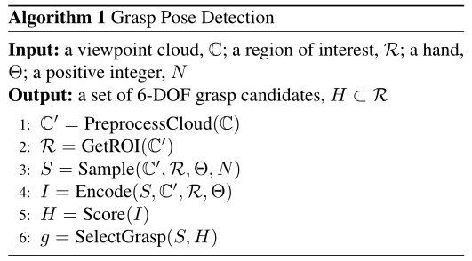

## Grasp Pose Detection in Point Clouds

> [ArXiv](https://arxiv.org/abs/1706.09911)
>
> [Github](https://github.com/atenpas/gpd)

#### Abstract

Recently, a number of grasp detection methods have been proposed that can be used to localize robotic grasp configurations directly from sensor data without estimating object pose. The underlying idea is to treat grasp perception analogously to object detection in computer vision. These methods take as input a noisy and partially occluded RGBD image or point cloud and produce as output pose estimates of viable grasps, without assuming a known CAD model of the object. Although these methods generalize grasp knowledge to new objects well, they have not yet been demonstrated to be reliable enough for wide use. Many grasp detection methods achieve grasp success rates (grasp successes as a fraction of the total number of grasp attempts) between 75% and 95% for novel objects presented in isolation or in light clutter. Not only are these success rates too low for practical grasping applications, but the light clutter scenarios that are evaluated often do not reflect the realities of real world grasping. This paper proposes a number of
innovations that together result in a significant improvement in grasp detection performance. The specific improvement in performance due to each of our contributions is quantitatively measured either in simulation or on robotic hardware.
Ultimately, we report a series of robotic experiments that average a 93% end-to-end grasp success rate for novel objects presented in dense clutter.

**近年来，人们提出了许多抓取检测方法，这些方法可以直接从传感器数据中定位机器人的抓取配置，而无需估计物体的姿态。其基本思想是将抓取感知类比于计算机视觉中的物体检测。这些方法将有噪声和部分遮挡的RGBD图像或点云作为输入，并产生可行抓取的姿态估计，而不假设物体的已知CAD模型。**虽然这些方法很好地将掌握的知识推广到新的对象，但它们还没有被证明足够可靠，可以广泛使用。许多抓取检测方法对于孤立或轻杂波中呈现的新物体，抓取成功率(抓取成功占抓取尝试总数的百分比)在75%到95%之间。不仅这些成功率对于实际抓取应用来说太低，而且评估的轻杂波场景通常也不能反映现实世界抓取的现实情况。本文提出了一些创新，这些创新共同导致了抓取检测性能的显著提高。由于我们的每一项贡献而导致的具体性能改进都是通过模拟或机器人硬件进行定量测量的。

最后，我们报告了一系列机器人实验，对于密集杂波中出现的新物体，平均93%的端到端抓取成功率。

#### Introduction

Traditionally, robotic grasping is understood in terms of two related subproblems: perception and planning. The perceptual component estimates the position and orientation (pose) of the object to be grasped. The planning component reasons about where/how to move the manipulator into a grasp configuration.

传统上，机器人抓取被理解为两个相关的子问题:**感知和规划**。知觉部分**估计要抓住的物体的位置和方向(姿态)**。规划组件**考虑在哪里/如何将机械手移动到抓取配置中**。

More recently, researchers have proposed various grasp detection methods that can be used to localize grasp configurations without estimating object pose.These methods take as input a noisy and partially occluded RGBD image or point cloud and produce as output pose estimates of viable grasps. For the most part, these methods treat grasp perception analogously to object detection in computer vision: first, they generate a large number of grasp candidates; then they evaluate the probability that each candidate is a grasp. A classifier or regression system is trained to detect parts of an image or
a point cloud that can be grasped given large amounts of grasp training data. Because these methods detect grasps independently of object identity, they typically generalize grasp knowledge to new objects well.

最近，研究人员提出了各种抓取检测方法，可用于在不估计物体姿态的情况下定位抓取配置。这些方法以噪声和部分闭塞的RGBD图像或点云作为输入，并产生可行抓取的姿态估计。在大多数情况下，这些方法将抓取感知类比于计算机视觉中的目标检测：**首先，它们生成大量的抓取候选对象；然后他们评估每个候选人被抓住的概率。因为这些方法检测抓取独立于对象身份，它们通常能很好地将抓取知识推广到新对象。**

#### Problem Statement（问题表述）and Algorithm

##### Model（个人理解）

Given a point cloud and a description of the geometry of a robotic hand, the grasp pose detection problem is to identify hand configurations from which a grasp would be formed if the fingers were to close. Let W ✓ R3 denote the robot workspace and let C ⇢ W denote a set of points in the 3-D point cloud perceived by one or more depth sensors registered to the robot workspace. We assume that each point in the cloud is paired with at least one viewpoint (camera location) from which that point was observed, ⇤ : C ! V, where V ⇢ R3 denotes the set of viewpoints. We will refer to the triple, C = (C, V, ⇤), as the viewpoint cloud. In this paper, we simplify the problem by requiring a two finger hand or a hand that functions like a two finger hand as defined below.

给定一堆点云信息和一个机械臂的几何描述，抓取姿势检测问题是指识别检测在手指合拢时将形成的抓取配置。W ✓ R3表示机器人（机械臂）的工作空间，C ⇢ W代表工作空间中的一组点云信息，假定点云信息中的每个点都与至少一个观测该点的视点（相机位置，是否是图片中的点）配对。⇤:C !V，表示工作空间下的所有的点云信息，V⇢R3就是视点的集合。我们将把三元组C = (C, V，⇤)称为视点云**viewpoint cloud**。

##### Problem

Given a viewpoint cloud, C, a region of interest, R ⇢ SE(3), and a two finger hand, the problem of grasp pose detection is to find one or more 6-DOF hand poses, h 2 R, such that a force closure grasp will be formed with respect to some object, O 2 O, when the hand closes.

给定一个视点云C，一个感兴趣的区域R⇢SE(3)和一个两个手指的手，抓握姿态检测的问题是找到一个或多个6-DOF手姿态h 2r，这样当手闭合时，就会对某个物体形成一个力闭合的抓握O 2 O。

##### Algorithm

Our algorithm follows the steps shown in Algorithm 1. Step 1 preprocesses the viewpoint cloud. Step 2 identifies a region of interest (ROI), R, where the grasp will occur. Step 3 samples N (several thousand) grasp candidates from the ROI where each candidate is a 6-DOF hand pose. Step 4 encodes each grasp candidate as a stacked multi-channel image. Step 5 assigns each candidate a score using a four- layer convolutional neural network that indicates how likely the candidate is to be a grasp. Step 6 selects a grasp for execution based on the score evaluated in Step 5 and other considerations related to the suitability of the grasp.

步骤1对视点云进行预处理。步骤2确定感兴趣的区域(ROI) ，即抓取将发生的地方。步骤3采样N个(几千个)从ROI中抓取候选人，其中每个候选人是一个6自由度的手姿势。步骤4将每个抓取候选图像编码为堆叠的多通道图像。步骤5使用四层卷积神经网络为每个候选人打分，表明候选人被抓住的可能性有多大。步骤6根据第5步中评估的分数和其他与抓握适宜性相关的考虑来选择抓点。

文中主要是对3 4 5 6步进行描述，步骤1通过体素化、去除异常值和执行其他标准步骤来压缩和去噪点云。任何可以减少点云中的噪声或错误的操作都应该在步骤1中执行。步骤2确定一个感兴趣的区域，我们有兴趣找到一个把握。值得注意的是，这并不一定意味着从背景中分割物体。ROI可以包括场景中的一组多个对象或所有对象。或者，它可以是使用物体检测方法(如本文末尾所描述的方法)所要抓住的物体位置的粗略近似。

#### 具体方法！！重点 实力有限表达不出来