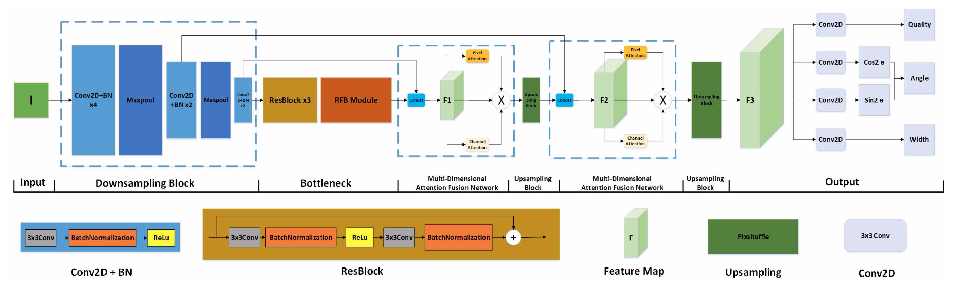
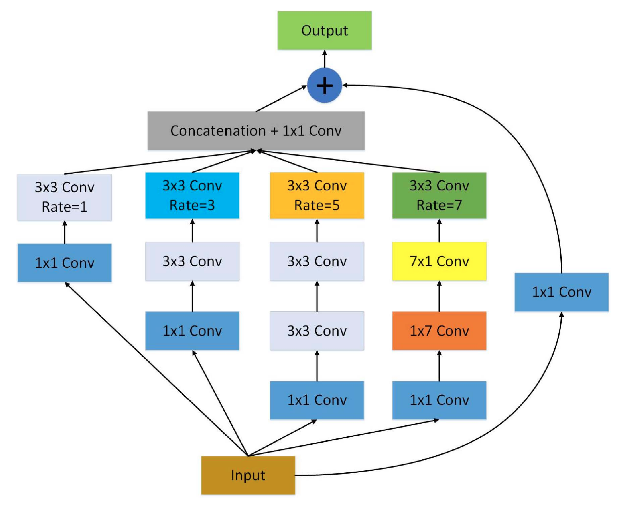
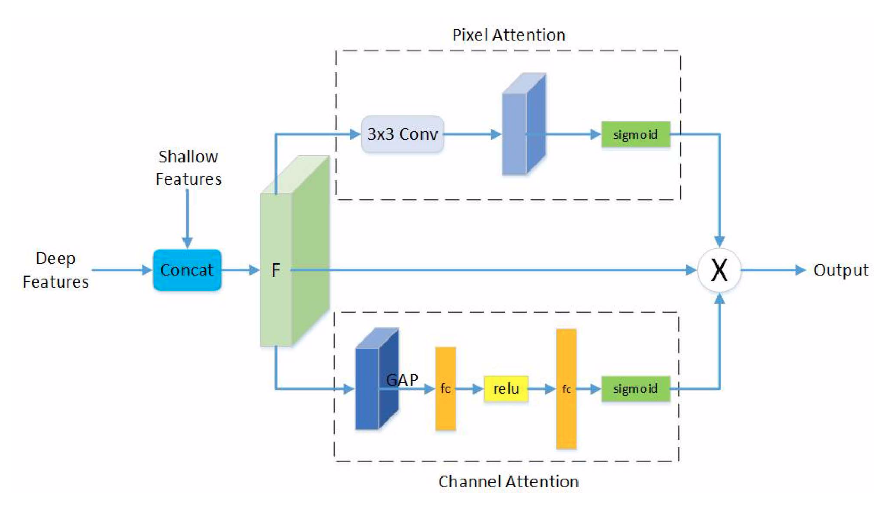

## Lightweight Convolutional Neural Network with Gaussian-based Grasping Representation for Robotic Grasping Detection (ArXiv)

## Efficient Grasp Detection Network With Gaussian-Based Grasp Representation for Robotic Manipulation (IEEE/ASME Transactions on Mechatronics)

> Published 25 January 2021 · Computer Science · ArXiv 
>
> Published 2022 · Computer Science · IEEE/ASME Transactions on Mechatronics
>
> [IEEE](https://ieeexplore.ieee.org/document/9990918)
>
> [ArXiv](https://arxiv.org/abs/2101.10226)
>
> Github

#### Abstract
The method of deep learning has achieved excellent results in improving the performance of robotic grasping detection. However, the deep learning methods used in general object detection are not suitable for robotic grasping detection.Current modern object detectors are difficult to strike a balance between high accuracy and fast inference speed. **In this paper,we present an efficient and robust fully convolutional neural network model to perform robotic grasping pose estimation from n-channel input image of the real grasping scene. The proposed network is a lightweight generative architecture for grasping detection in one stage. Specifically, a grasping representation based on Guassian kernel is introduced to encode training samples, which embodies the principle of maximumcentral point grasping confidence. Meanwhile, to extract multiscale information and enhance the feature discriminability, a receptive field block (RFB) is assembled to the bottleneck of our grasping detection architecture. Besides, pixel attention and channel attention are combined to automatically learn to focus on fusing context information of varying shapes and sizes by suppressing the noise feature and highlighting the graspingobject feature.** Extensive experiments on two public grasping datasets, Cornell and Jacquard demonstrate the state-of-the-art performance of our method in balancing accuracy and inference speed. The network is an order of magnitude smaller than other excellent algorithms, while achieving better performance with accuracy of 98.9% and 95.6% on the Cornell and Jacquard datasets, respectively.

在本文中，我们提出了一种高效且鲁棒的全卷积神经网络模型，用于从真实抓取场景的n通道输入图像中执行机器人抓取姿态估计。所提出的网络是一种轻量级的生成架构，可在一个阶段内完成检测。特别地，引入了一种基于高斯核的抓取表示来对训练样本进行编码，体现了最大中心点抓取置信度的原理。同时，为了提取多尺度信息并提高特征的可分辨性，将感知场块（RFB）组装到我们的抓取检测架构的瓶颈。此外，像素注意力和通道注意力相结合，通过抑制噪声特征和突出抓取对象特征，自动学习聚焦于融合不同形状和大小的上下文信息。

#### Introduction
...
In this work, we utilize 2-D Guassian kernel to encode training samples to emphasize that the center point position with the highest grasping confidence score. On the basis of Guassian-based grasping representation, we develop a lightweight generative architecture for robotic grasping pose estimation. Referring to the receptive field structure in humanvisual system, we combine the residual block and a receptive field block module in the bottleneck layer to enhance the feature discriminability and robustness. In addition, in order to reduce the information loss in the sampling process, we fuse low-level features with depth features in the decoder process,and use a multi-dimensional attention network composed of pixel attention network and channel attention network to suppress redundant features and highlight meaningful features in the fusion process. Extensive experiments demonstrate that our algorithm achieves state-of-the-art performance in accuracy and inference speed on the public grasping datasets Cornell and Jacquard with a small network parameter size. Concretely,the main contributions of this paper are as follows:
- We propose a Gaussian-based grasping representation,which relects the maximum grasping score at the center point location and can signigicantly improve the grasping detection accuracy.
- We develope a lightweight generative architecture which achieves high detection accuracy and real-time running speed with small network parameters.
- A receptive field block module is embedded in the bottleneck of the network to enhance its feature discriminability and robustness, and a multi-dimensional attention fusion network is developed to suppress redundant features and enhance target features in the fusion process.
- Evaluation on the public Cornell and Jacquard grasping datasets demonstrate that the proposed generative based grasping detection algorithm achieves state-of-the-art performance of both speed and detection accuracy.

#### Robotic Grasping System
##### A. System Setting
A robotic grasping system usually consists of a robot arm,perception sensors, grasping objects and workspace. In orderto complete the grasping task successfully, not only the grasp pose of objects needs to be obtained, but the subsystem of planning and control is involved. In grasping detection part,we consider limiting the manipulator to the normal direction of the workspace so that it becomes a goal for perception in 2D space. Through this setting, most of the grasping objects can be considered as flat objects by placing them reasonably on the workbench. Instead of building 3D point cloud data,the whole grasping system can reduce the cost of storage and calculation and improve its operation capacity. The grasp pose of flat objects can be treated as a rectangle. Since the size of each plate gripper is fixed, we use a simplified grasping representation mentioned in section II-B to perform grasp pose estimation.

机器人抓取系统通常由机械臂、感知传感器、抓取物体和工作空间组成。为了成功地完成抓取任务，不仅需要获得物体的姿态，还涉及到规划和控制子系统。在抓取检测部分，我们考虑将机械手限制在工作空间的法线方向，使其成为二维空间中感知的目标。通过这种设置，通过将抓取物体合理地放置在工作台上，可以将大多数抓取物体视为平面物体。整个抓取系统不需要构建三维点云数据，可以降低存储和计算成本，提高操作能力。平面物体的抓取姿态可以看作一个矩形。由于每个抓板器的尺寸是固定的，我们使用第II-B节中提到的简化的抓板器表示来进行抓板姿势估计。

##### B. Gaussian-based grasp representation
The grasp detection model should take RGB or depth imagesas inputs to generate grasp candidates for subsequent manipulation tasks.Works from literature built their grasp detection model for grasp pose prediction based on 5-D grasp representation:
$$
g = \{x,y,\theta,w,h\}
$$
where the center point is denoted as $(x, y)$. $\theta$ is the grasp angle and $(w,h)$ is the weight and height of the grasp rectangle, respectively. The 5-D grasp representation is borrowed from conventional object detection, but is not perfectly suited for robotic grasp detection. The simplified grasp representation for fast robotic grasp detection can be formulated as in the following:
$$
g = \{\pmb{p},φ,w,h\}
$$
where $\pmb p$ is the position of the center point expressed in Cartesian coordinates as $\pmb p=(x, y, z)$.The $φ$ and $w$ denote the grasp angle and grasp width, respectively, and $q$ is a scale factor for measuring the grasp quality. Furthermore, the new grasp representation in 2-D space is represented in the following:
$$
\hat{g} = \{\hat{p},\hat{φ},\hat{w},\hat{h}\}
$$
where $\hat{p}$ is the center point in the image coordinates denoted as $\hat{p}=(u, v)$. $\hat{φ}$ represents the grasp angle in the camera frame. $\hat{w}$ and $\hat q$ denote the grasp width and the grasp quality, respectively. After obtaining the grasp system calibration results, matrix operations transform the grasp pose $\hat{p}$ into world coordinates $p$, as in the following:
$$
g = T_{RC}(T_{CI}(\hat{g}))
$$
where $T_{RC}$ is the transformation matrix from camera frames toworld frames and $T_{CI}$ is the transformation matrix from 2-D image space to camera frames. The grasp map in image spaceis denoted in the following:
$$
G = \{\Phi,W,Q\} \in \mathbb{R}^{3 \times W \times H}
$$
where the pixels of grasp maps, $\Phi$, $W$, $Q$, are filled with the corresponding values of $\hat{φ}$, $\hat{w}$, $\hat{q}$. The central location can be found by searching the pixel coordinate with the maximum grasp quality $\hat{g^∗}=max_{\hat{Q}}\hat{G}$. The authors in ("Learning robust, real-time, reactiverobotic grasping") filled a rectangular area around the center with 1, indicating the highest grasp quality and other pixels as 0. The training model learns the maximum grasp quality of the center. Because all pixels in the rectangular area have the best grasping quality, it leads to a limitation that the importance of the center point is not highlighted, resulting in ambiguity in the model. In this work, we use a 2-D Gaussian kernel to regularize the grasp representation to indicate where the object center might exist, as shown in Fig. 1. The novel GGR is represented as $g_k$. The corresponding Gaussian-based grasp map is defined in the following:
$$
G_K = \{\Phi,W,Q_K\} \in \mathbb{R}^{3 \times W \times H}
$$
where
$$
Q_K = K(x,y) = exp(-\frac{(x - x_0)^2}{2\sigma_x^2}-\frac{(y - y_0)^2}{2\sigma_y^2})
$$
where
$$
\sigma_x = T_x, \quad \sigma_y = T_y
$$
In the abovementioned equation, the generated grasp quality map is decided by the center point location $(x_0,y_0)$, the parameter $σ_x$ and $σ_y$, and the corresponding scale factor $T_x$ and $T_y$. In this method, the peak of the Gaussian distribution is the center coordinate of the grasp rectangle.

#### Method
In this section, we introduce a lightweight generative architecture for robotic grasp detection.Fig. 2 presents the overall structure of our grasp detection model. **The input data are downsampled into feature maps with smaller sizes, morechannels, and richer semantic information. ResNet and the multiscale RFB are combined in the bottleneck to extract more discriminability and robustness features. Furthermore, an MDAFN consisting of pixel-based and channel-based attention subnetworks is used to fuse shallow and deep semantic features.** The proposed model suppresses redundant features andenhances the object features during the fusion process basedon the attention mechanism. Finally, based on the extractedfeatures, four task-specific subnetworks are added to predictgrasp quality, angle (in the form of sin(2θ)and cos(2θ)), andwidth, respectively. A detailed illustration of each component ofthe proposed grasp network is depicted in the following sections.

做法：
1. 输入数据被下采样为具有更小尺寸、更多通道和更丰富语义信息的特征图。（为什么会有更丰富的语义信息？）
2. ResNet和多尺度RFB在瓶颈中相结合，以提取更具可分辨性和鲁棒性的特征
3. 由基于像素和基于通道的注意力子网络组成的MDAFN用于融合浅层和深层语义特征，在融合过程中基于注意力机制抑制冗余特征，增强目标特征

结果：
基于提取的特征，添加了四个特定于任务的子网络，分别用于预测抓取质量、角度（以 $\sin(2\theta)$ 和$\cos(2\theta)$ 的形式）和宽度。（回归）

##### A. Basic Network Architecture
The proposed generative grasp architecture comprises of **the down-sampling block, bottleneck layer, MDAFN(Multi-Dimensional Attention Fusion Network), and up-sampling block,** as shown inFig. 2. **The down-sampling block consists of a convolutional layer with a kernel size of 3×3 and a maximum pooling layer with a kernel size of 2×2**, which can be represented in the following:
$$
x_d = f_{maxpool}(f_{conv}^n(f_{conv}^{n-1}(...f_{conv}^0(I)...))).
$$
In this article, we use two down-sampling blocks and two con-volutional layers in the down-sampling process. **The first down-sampling block comprises four convolutional layers (n=3) and one maximum pooling layer. The second down-sampling layer comprises two convolutional layers (n=1) and one maximum pooling layer. After the downsampled data passes through two convolutional layers, it is fed into a bottleneck layer consisting of three residual blocks (k=2) and one RFB to extract features.** Since RFB comprises various scale convolutional filters, it is possible to acquire richer image details. More illustrations of RFB are presented in Section III-B. The output of the bottleneckcan be formulated in the following:
$$
x_b = f_{RFBM}(f_{res}^k(f_{res}^{k-1}(...f_{res}^0(f_{conv}^1(f_{conv}^0(x_d)))...))).
$$
The output xb of the bottleneck is fed into an MDAFN and upsampling block. **The MDAFN composed of pixel attention and channel attention subnetworks can suppress the noise features and enhance the valuable features during the fusion of shallow features and deep features**. The detailed illustration ofthe MDAFN is presented in Section III-C. In the upsampling block, the pixshuffle layer increases feature resolution with the scale factor set to 2. In this work, the number of MDAFN and upsampling blocks is two, and the output is represented in the following:
$$
x_u = f_{pixshuffle}^1(f_{MDAFN}^1(f_{pixshuffle}^0(f_{pixshuffle}^0(x_b)))).
$$
**The final layer consists of four convolutional filters with a kernel size of 3×3**. The corresponding outputs can be expressedin the following:
$$
g_q = \max\limits_q(f_{conv}^0(x_u)) \\
g_{\cos(2\theta)} = \max\limits_q(f_{conv}^1(x_u)) \\
g_{\sin(2\theta)} = \max\limits_q(f_{conv}^2(x_u)) \\
g_w = \max\limits_q(f_{conv}^3(x_u))
$$
where the center point is located by searching the pixel coordinate with the highest grasp quality $g_q$.$g_w$ denotes the grasp width, and the grasp angle is calculated by $g_{angle} = \arctan(\frac{g_{\sin(2\theta)}}{g_{\cos(2\theta)}})/2$.

##### B. Multiscale RFB
In neuroscience, researchers have discovered a particular function in the human visible cortex that regulates the size of the visible receptive area. This mechanism can help to emphasize the importance of the area near the center. For robotic grasping tasks, multiscale receptive fields can enhance the neural network’s deep features. We hope to enhance the model’s receptive field to improve its feature extraction capability for multigrasp objects. In this work, we introduce a multiscale RFB to assemble the bottleneck layer to improve the model’s receptive field capability. The RFB comprises multi-branch convolutional layers with different kernels corresponding to the receptive fields of various sizes. The dilated convolution layer controls the eccentricity, and the features extracted by the branches of the different receptive fields are recombined to form the final representation, as shown in Fig 3. In each branch, the convolutional layer follows a dilated convolutional layer. The kernel sizes are a combination of (1×1, 3×3, 7×1, 1×7). The features extracted from the four branches are concatenated and then added to the input data to obtain the final multiscale feature output.

在神经科学中，研究人员在人类可见皮层中发现了一种特殊的功能，它调节可见感受区的大小。这种机制有助于强调中心附近区域的重要性。**对于机器人抓取任务，多尺度感受野可以增强神经网络的深层特征。我们希望增强模型的感受野，以提高其对多层次对象的特征提取能力。** 在这项工作中，我们引入了多级RFB来组装瓶颈层，以提高模型的感受野能力。RFB包括多分支卷积层，其具有与不同大小的感受野相对应的不同边缘。扩张的卷积层控制离心率，不同感受野分支提取的特征被重组以形成最终的表示，如图3所示。在每个分支中，卷积层遵循一个扩张的卷积层。内核大小是（1×1，3×3，7×1，1×7）的组合。将从四个分支中提取的特征连接起来，然后将其添加到输入数据中，以获得最终的多尺度特征输出。

##### C. Multidimensional Attention Fusion Network
When humans look at an image, not much attention is paid to everything; instead, more focus is paid to what is interesting. In computer vision, attention mechanisms with few parameters,fast speed, and excellent effects have been developed.The motivation for MDAFN is to effectivelyperceive grasping objects against a complex background. Thisattention mechanism can suppress the noise features and high-light the object features. As shown in Fig. 4, the shallow and deep features are concatenated together. The concatenated features are fed into MDAFN to perform representation learning at pixel-level and channel-level.The feature map F passes through a 3×3 convolution layer in the pixel attention subnetwork to generate an attention map by a convolution operation. The attention map is computed with a sigmoid to obtain the corresponding pixelwise weight score. SENet is then used as the channel attention subnetwork, which accepts 1×1×C features through global average pooling. It then uses two feedforward layers and the corresponding activation function ReLU to build the correlation between channels and finally outputs the weight score of the feature channel through the sigmoid operation.Both pixelwise and channelwise weight maps are multiplied with the feature map F to obtain a novel output with reduced noise and enhanced object information.

当人类看一幅图像时，并没有太多的注意力放在一切上；在计算机视觉中，已经开发出了参数少、速度快、效果好的注意力机制。MDAFN的动机是在复杂的背景下有效地感知抓取物体。这种注意力机制可以抑制噪声特征和高光物体特征。浅特征和深特征串联在一起。连接的特征被馈送到MDAFN中，以在像素级和通道级执行表示学习。特征图F通过像素注意力子网络中的3×3卷积层，通过卷积运算生成注意力图。注意力特征图是用Sigmod函数来计算的，以获得相应的像素权重得分。然后使用SENet作为通道注意力子网络，该子网络通过全局平均池接受1×1×C的特征。然后，它使用两个前馈层和相应的激活函数ReLU来建立通道之间的相关性，并最终通过Sigmod函数运算输出特征通道的权值。把像素权重得分和通道权重得分与特征图F相乘以获得具有降低的噪声和增强的对象信息的新输出。

##### Loss Function
The neural network model can be considered as a method to approximate the complex function $F:I→\hat{G}$ for input images $I=\{I_1...I_n\}$ and corresponding grasp labels $L=\{L_1...L_n\}$. $F$ is the proposed grasp model and $I$ is the input image.$\hat{G}$ denotes the grasp prediction. Specifically, the model is trained on the dataset to learn the grasp detection function $F$ by optimizing minimum errors between grasp predictions $\hat{G}$ and the corresponding labels $L$. This task is a regression problem, so the Smooth $L1$ loss is deployed as the loss function to optimize our model. The loss function $L_r$ is formulated in the following:
$$
L_r(\hat{G}, L) = \sum\limits_i^{N} \sum\limits_{m \in \{q, \cos2\theta,\sin2\theta, w\}} Smooth_{L1}(\hat{G}_i^m - L_i^m)
$$
where $Smooth_{L1}$ is defined as
$$
Smooth_{L1}(x) = \left\{
\begin{matrix}
(\sigma x)^2 / 2, \quad if \vert x \vert <1 \\
\vert x \vert - 0.5/\sigma^2, \quad otherwise 
\end{matrix}
\right.
$$
where $N$ represents the count of grasp candidates, the grasp angle is defined as the form of $(\cos(2\theta),\sin(2\theta))$. $q$, $w$ denote the grasp quality and grasp width, respectively. $\sigma$ is the hyperparameter in the $Smooth_{L1}$ function, which controls the smooth area.
