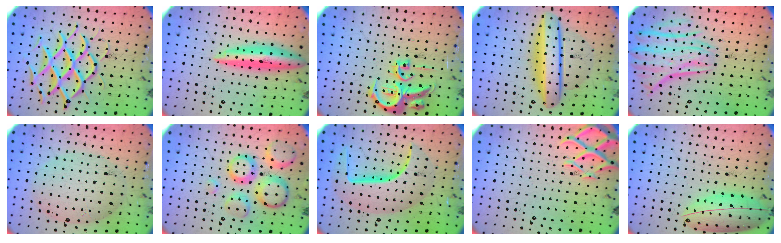
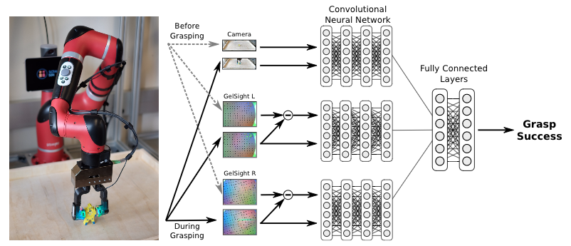
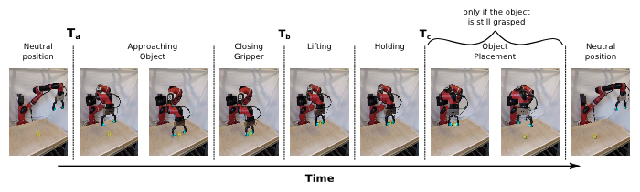
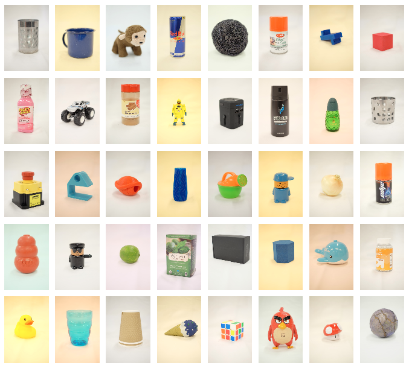
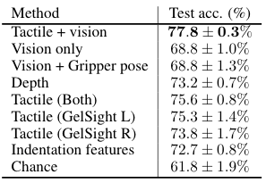
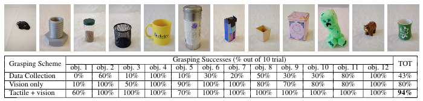

## The Feeling of Success: Does Touch Sensing Help Predict Grasp Outcomes?

> Published 16 October 2017 · Psychology · ArXiv
>
> [ArXiv](https://arxiv.org/abs/1710.05512v1)
>
> [Github](https://github.com/swchui/VTFSA)

#### Abstract

A successful grasp requires careful balancing of the contact forces.Deducing whether a particular grasp will be successful from indirect measure-ments, such as vision, is therefore quite challenging, and direct sensing of con-tacts through touch sensing provides an appealing avenue toward more successfuland consistent robotic grasping. However, in order to fully evaluate the valueof touch sensing for grasp outcome prediction, we must understand how touchsensing can influence outcome prediction accuracy when combined with othermodalities. Doing so using conventional model-based techniques is exceptionallydifficult. In this work, we investigate the question of whether touch sensing aidsin predicting grasp outcomes within a multimodal sensing framework that com-bines vision and touch. To that end, we collected more than 9,000 grasping trialsusing a two-finger gripper equipped with GelSight high-resolution tactile sensorson each finger, and evaluated visuo-tactile deep neural network models to directlypredict grasp outcomes from either modality individually, and from both modali-ties together. Our experimental results indicate that incorporating tactile readingssubstantially improve grasping performance.

从视觉等间接测量中推断特定的抓握是否成功是非常具有挑战性的，而通过**触摸传感**直接感知接触为更成功、更一致的机器人抓握提供了一条有吸引力的途径。然而，为了充分评估触摸感应对抓握结果预测的价值，我们必须了解触摸感应与其他模式相结合时如何影响结果预测的准确性。使用传统的基于模型的技术做到这一点是非常困难的。在这项工作中，我们**研究了触摸传感是否有助于在结合视觉和触摸的多模态传感框架内预测抓握结果的问题**。

**我们的实验结果表明，结合触觉读数可以显著提高抓握性能**。

#### 1. Introduction
Humans make extensive use of multi-modal perception when grasping, including visual and tactile sensing. While vision allowsfast localization of objects, touch provides accurate perception ofcompliance and contact force once contact is established, evenwhen the grasp itself is hard to see. In manipulation, the use oftactile sensors has been demonstrated for detecting and compensat-ing for slip, and for grasping fragile objects. Nonethe-less, adoption of tactile sensors has been slow, due to hardware lim-itations of the technologies employed (e.g., sensitivity, cost) and,more importantly, due to the challenges associated with integratingtactile sensors into standard control schemes. Tactile readings aretypically difficult to model, and and small errors in measurementand calibration can substantially reduce the performance of eventhe best analytic models.

人类在抓握时广泛使用多模态感知，包括视觉和触觉感知。**虽然视觉可以快速定位物体，但一旦建立接触，即使抓握本身很难看到，触摸也能准确感知一致性和接触力**。在操作中，已证明使用活动传感器来检测和补偿打滑和抓取易碎物体。更重要的是，由于所采用技术的硬件限制（例如灵敏度、成本），以及更重要的，由于将触觉传感器集成到标准控制方案中的挑战，触觉传感器的采用一直很慢。触觉读数通常很难建模，测量和校准中的小误差会大大降低最佳分析模型的性能。

In this paper, we aim to answer the question of whether integrating touch sensing aids in predict-ing grasp outcomes. However, the answer to this question is complicated by the inherent difficultyof integrating vision and touch into a multi-modal sensing framework. We propose to employ anend-to-end learning approach for predicting grasp outcome, which allows us to evaluate the relativeimportance of each modality, as well as the combined multi-modal framework, in a series of con-trolled experiments. For touch sensing, we employ the GelSight tactile sensors,which provide high-resolution images of the deformation caused by contacts with graspable objects(see examples in Figure 2). We train deep neural networks for vision-based, touch-based, and com-bined vision and touch-based grasp outcome prediction. A robot can then employ these models forgrasping by attempting various grasp locations, and choosing the one for which the model predictsthe highest probability of success. To our knowledge, this work is the first to present an end-to-endlearned system for robotic grasping that combines rich visual and tactile sensing, and provides a con-trolled evaluation of the benefits of touch sensing for grasp performance. Our method is substantiallysimpler than manually designed analytic grasping metrics, and the experimental resultsdemonstrate that incorporating tactile sensing improves overall grasping performance substantially.

在本文中，我们旨在**回答集成触摸感应是否有助于预测抓握结果的问题**。然而，这个问题的答案由于将视觉和触摸集成到多模态传感框架中的固有困难而变得复杂。我们建议使用一种端到端的学习方法来预测抓取结果，这使我们能够在一系列受控实验中评估每种模态以及组合的多模态框架的相对重要性。对于触摸传感，我们使用 ***GelSight触觉传感器***，它提供了与可抓取物体接触引起的变形的高分辨率图像（如下图）。我们训练深度神经网络用于基于视觉、基于触摸以及基于视觉和触摸的组合抓取结果预测。然后，机器人可以通过尝试不同的抓取位置，并选择模型预测成功概率最高的抓取位置来使用这些模型进行抓取。据我们所知，这项工作**首次提出了一种用于机器人抓取的端到端学习系统，该系统结合了丰富的视觉和触觉传感，并对触摸传感对抓取性能的好处进行了可控评估**。我们的方法比手动设计的分析抓取指标要简单得多，实验结果表明，**结合触觉传感大大提高了整体抓取性能**。

#### 2. Related Work
**The GelSight sensor.** The GelSight sensor is an optical tactile sensor that measures high-resolution topography of the contact surface. The surface of the sensor is a soft elastomerpainted with a reflective membrane, which deforms to the shape of the object upon contact. Under-neath this elastomer is an ordinary webcam that views the deformed gel. The gel is illuminated bycolored LEDs, which light the gel from different directions. showed that for thegrasping tasks, the GelSight signal can predict or detect slip from 3 different kinds of information:movement of the object texture, loss of contact area, and the stretching of the sensor surface. Oneimportant advantage of the GelSight sensor is that the sensory data consists of a standard 2D image,allowing for standard convolutional neural network architectures designed for visual sensing to beused to process the sensor’s readings. Prior work on material estimation with the GelSight successfully applied convolutional neural networks that were pretrained from natural image data.

**GelSight传感器** GelSigght传感器是一种光学触觉传感器，可测量接触表面的高分辨率形貌。传感器的表面是一个涂有反射膜的柔软弹性体，在接触时会变形为物体的形状。在这种弹性体下面是一个普通的网络摄像头，可以看到变形的凝胶。凝胶由彩色LED照明，LED从不同方向照亮凝胶。对于研磨任务，GelSight信号可以根据3种不同的信息预测或检测滑动：物体纹理的移动、接触面积的损失和传感器表面的拉伸。GelSight传感器的一个重要优势是，传感数据由标准2D图像组成，允许使用为视觉传感设计的标准卷积神经网络架构来处理传感器的读数。先前使用GelSight进行的材料估计工作成功地应用了从自然图像数据中预训练的卷积神经网络。GelSight的原始触觉数据示例如上图所示。

#### 3. Predicting Successful Grasps from Vision and Touch
Consider the placement of the robot’s gripper in Figure 3. If the robot attempts to grasp the objectfrom this position, will it be successful? Here, the sensory modalities give different – and possiblycomplementary – information about the prospects for a successful grasp. For example, we can tellfrom the camera image that the gripper is in a favorable position – near the object’s center of mass –and we can also tell from the tactile information that the object is rigid, with many bumps and ridges,and therefore is unlikely to slip. To study how much tactile sensing helps us predict grasp outcomes,we train a neural network to predict whether a robot’s grasp will be successful using a combination oftactile and visual cues. This network computes $y=(x)$, where $y$ is the probability of a successful grasp, and $x$ contains a set of images from multiple modalities: $x=(I_{RGB},I_{GelsightR},I_{GelsightL})$, where $I_{RGB}$ represents an RGB image from the frontal camera, and $I_{GelsightR}$ and $I_{GelsightL}$ are the RGB images recorded by the two fingertip GelSight sensors. In our experiments (see Section 6), we compared against different combinations of inputs, such as only vision, only tactile input or using adepth map in place of the RGB image.

 
我们训练了一个神经网络，通过结合动作和视觉线索来预测机器人的抓握是否成功。**该网络计算 $y=(x)$，其中 $y$ 是成功抓取的概率，$x$ 包含来自多个模态的一组图像：$x=(I_{RGB},I_{GelsightR},I_{GelsightL})$，其中 $I_{RGB}$ 表示来自正面相机的RGB图像，$I_{GelsightR}$ 和 $I_{GelsightL}$ 表示两个指尖 GelSight 传感器记录的 RGB 图像。**

Since all of the inputs to the model – including the tactile input – are images, we represent $f$ as a convolutional neural network. Following other multi-modal learning work, we fuse the different modalities at a late stage in the model. As illustrated in Figure 3, the images are first passed through a standard convolutional network, which in our case uses the ResNet-50 architecture (fine-tuned during the training, as detailed below). The results of these independent convolutions are then concatenated and fed into a two-layer, fully-connected network. For both the visual and tactile inputs, we make use of temporal information. For the RGB images, we simply supply the network with two images: an image $I_{T_\alpha}$ taken before the grasp (where the object is unoccluded), and one $I_{T_\beta}$ at the moment of the grasp (at which point the gripper has been placed on the object). The features from both networks – specifically, the spatially-pooled features from the penultimate layer of each ResNet model – are then concatenated together. For the GelSight model, we exploit the fact that deformations in the gel can be expressed as temporal derivatives, and apply the network to thetemporal difference $I_{T_\beta} - I_{T_\alpha}$.

由于模型的所有输入,包括触觉输入,都是图像，我们将其表示为卷积神经网络。**在各个模态学习工作之后，我们在模型的后期融合了不同的模态。图像首先通过标准卷积网络，在我们的情况下，该网络使用ResNet-50架构。得到这些独立卷积的结果然后连接并馈送到一个两层、完全连接的网络中。对于视觉和触觉输入，我们都利用了时间信息。对于RGB图像，我们只需为网络提供两个图像：一个是抓取前的图像 $I_{T_\alpha}$（对象未被遮挡的位置），另一个是抓握时的图像 $I_{T_\beta}$（抓取器已放置在对象上的位置）。然后将两个网络的特征，特别是每个 ResNet 模型倒数第二层的空间合并特征连接在一起。对于 GelSight 模型，我们利用了凝胶中的变形可以表示为时间导数的事实，并将网络应用于时间差 $I_{T_\beta} - I_{T_\alpha}$。**

**Training the network** We initialize the weights of both the visual and tactile CNNs using a modelpre-trained on ImageNet, and we share parameters between networks of the same modality(e.g., both GelSight sensors use the same network weights). We train the network or 20 epochs using the Adam optimizer, starting with a learning rate of $10^{-4}$ (which we decrease by an order of magnitude halfway through the training process). During training, we apply data augmentation to the input data. For the RGB images, we first crop thei mages with a bounding box containing the table that holds the objects(padded vertically to providea view of the robot’s gripper). Then, following standard practice in object recognition, we resizethese images to be 256×256, and randomly sample 224×224 crops from them. We also randomly flip the images in the horizontal direction. The GelSight images lack the stationarity properties ofnatural images, due to the fixed locations of the lights and the borders of the gel. However, we still apply these same data augmentation techniques to prevent the algorithm from overfitting to the appearance of a particular sensor’s gel.

训练网络我们使用在ImageNet上预先训练的模型初始化视觉和触觉图像神经网络的权重，并且我们在相同模态的网络之间共享参数（例如，两个GelSight传感器使用相同的网络权重）。我们使用Adam优化器对网络或20个epochs进行训练，从$10^{-4}$的学习率开始（在训练过程的中途，我们将其降低一个数量级）。在训练过程中，我们将数据扩充应用于输入数据。对于RGB图像，我们首先用一个边界框裁剪图像，该边界框包含保存对象的表格（垂直填充以提供机器人抓取器的视图）。然后，按照物体识别的标准实践，我们将这些图像重新调整为256×256，并从中随机采样裁剪成224×224。我们还可以在水平方向上随意翻转图像。

#### 4. Grasping with Vision and Touch
In this section, we detail how the model learned in Section 3 can be used for selecting grasping configurations. Since the model predicts the grasp outcome based on visual and tactile readings, we must close the fingers around an object before we can evaluate the model’s prediction. To that end, in our experimental comparison we perform randomly chosen gripper closures in the vicinity of the object, evaluate the prediction of the model on each one, and accept the gripper pose for which the model predicts a sufficiently high probability of a successful outcome. Specifically, we randomly vary the grasp parameters $\theta = [EE_x, EE_y, EE_z, \phi, F]$, where $[EE_x, EE_y, EE_z]$ are the end-effector x-y-z coordinates, $\theta \in [0, \pi]$ is the angle of the gripper, and $F$ is the force applied by the gripper. At each iteration, we randomly select a set of parameters, move the gripper to the desired configuration, close the gripper, and then evaluate the success rate predicted by the model (e.g., using the visualand tactile data described in Section 3) for the measured visual and tactile readings. If the success rate is above a pre-defined threshold (0.9 in our experiments), the grasp is considered potentially successful, and the object is lifted to observe the outcome of the grasp. Otherwise, a new random set of parameters is selected and the exploration continues. While in theory this approach might never stop, in practice, in our experiments most trials would last less then a couple of minutes. Overall, this scheme can be intuitively summarized as having two separate mechanism, one which proposes grasps (i.e., random search), and one that rejects them (i.e., the model); The process is over once a proposal is accepted. In future work, this process might be accelerated by incorporating anoptimization procedure into the grasp selection, instead of proposing grasps at random. However, for the purposes of evaluating the practical differences between purely visual and visuo-tactile grasping, we found that this simple approach was sufficient.

由于该模型基于视觉和触觉来预测抓握结果，因此在评估该模型的预测之前，我们必须闭合物体周围的手指。为此，在我们的实验比较中，我们在对象附近进行随机选择的夹持器闭合，评估模型对每个夹持器的预测，并接受模型预测成功概率足够高的夹持姿势。**具体来说，我们随机改变抓取参数 $\theta = [EE_x, EE_y, EE_z, \phi, F]$，其中 $[EE_x, EE_y, EE_z]$ 是末端效应器的 x-y-z 坐标，$\theta \in [0, pi]$ 是夹具的角度，$F$ 是夹具施加的力。在每次迭代中，我们随机选择一组参数，将夹持器移动到所需配置，关闭夹持器，然后评估模型预测的成功率。如果成功率高于预定义的阈值（在我们的实验中为0.9），则抓握被认为是潜在的成功，并且物体被抬起以观察抓握的结果。否则，将选择一组新的随机参数，并继续探索。** 虽然在理论上，这种方法可能永远不会停止，但在实践中，在我们的实验中，大多数试验只持续不到几分钟。总的来说，这个方案可以直观地总结为有两个独立的机制，一个 **提出抓取（即随机搜索）**，另一个 **拒绝抓取（即模型）**；一旦提案被接受，这个过程就结束了。在未来的工作中，这一过程可能会通过将优化程序纳入抓取选择中而不是随机提出抓取来加速。

#### 5. Experimental Setting & Data Collection

The data collection process was automated to allow for large scale continuous data collection. In each trial, depth data from the Kinect was used to approximately identify the position of the objectand fit a rough cylindrical proxy. We then selected the grasp positions $[EE_x, EE_y]$ to be the center of the cylinder, plus a small random perturbation. The height $[EE_z]$ was set to a random height between the table and the top of the cylinder, and $\phi$ was set to a random gripper orientation. Moreover, we randomized the gripping force $F$ to collect a large variety of behaviors, from firm, stable grasps, tooccasional slips, to overly gentle grasps that fail more often. After moving to the chosen position and orientation and closing the gripper with the desired gripping force, the gripper would then attempt to lift the object and wait in the air for two seconds. If the object was still in the gripper at the end of the two seconds, the robot would then put the object back at a randomized position, and a new trial would start. During each trial we considered three snapshots: 1) $T_a$ is the initial state of the system(with the arm in rest position, outside the view of the camera). 2) $T_b$ measures the state when the gripper completed the closure of the fingers, but the object is still on the ground. 3) Finally, $T_c$ is measured two seconds after the completed lift-off, to give time to the object to stabilize or eventually slip. Of these three snapshots, $T_a$ and $T_b$ are used as inputs to our models, while $T_c$ is used to label the data. A visualization of the chronology of the data collection and of the three snapshots is shown in Figure 4. Overall, each trial took ∼ 60 seconds of robot execution.
The labels for this data were automatically generated using a deep neural network classifier trained to detect contacts using the raw GelSight images measured at $T_c$. We performed additional manual labeling on small set of the collected data for which the automatic classification was border line ambiguous, or in the rare cases when a visual inspection would indicate a wrong label. Overall, we collected 9269 grasping trials from 106 unique objects.

数据收集过程实现了自动化，以实现大规模连续数据收集。**在每次试验中，Kinect的深度数据被用来近似识别物体的位置，并拟合一个粗糙的圆柱形。然后，我们选择抓取位置 $[EE_x, EE_y]$ 作为圆柱体的中心，再加上一个小的随机扰动。高度 $[EE_z]$ 设置为工作台和圆柱体顶部之间的随机高度，$\phi$ 设置为随机夹具方向。此外，对抓握力 $F$ 进行了加权，以收集各种行为，从牢固、稳定的抓握、偶尔的打滑，到更频繁失败的过于温和的抓握。在移动到选定的位置和方向并用所需的夹持力关闭夹持器后，夹持器将尝试抬起物体并在空中等待两秒钟。如果在两秒钟结束时物体仍在夹具中，机器人会将物体放回随机位置，然后开始新的试验。在每次试验中，我们考虑了三个快照：1）$T_a$ 是系统的初始状态（手臂处于静止位置，在相机视野之外）。2）$T_b$ 测量裂土器完成手指闭合，但物体仍在地面上时的状态。3） 最后，在完成升空后两秒钟测量 $T_c$，以便给物体稳定或最终打滑的时间。在这三个快照中，$T_a$ 和 $T_b$ 被用作我们模型的输入，而 $T_c$ 被用于标记数据。** 数据收集和三个快照如图所示。总的来说，每次试验都花费了约60秒的机器人执行时间。
这些数据的标签是使用深度神经网络分类器自动生成的，该分类器经过训练，使用 $T_c$ 测量的原始 GelSight 图像来检测接触。我们对一小部分收集到的数据进行了额外的手工标记，这些数据的自动分类是边界模糊的，或者在极少数情况下，当视觉检查会指示错误的标签时。总体而言，我们从106个独特的物体中收集了9269次抓握试验，其中一些如下图所示。

#### 6. Experimental Results
We evaluate the models by 1) comparing their accuracy at predicting grasp outcome on unseen test data 2) evaluating their performance at actually choosing successful grasps in a real-world robotic experiment. 

##### 6.1 Comparison on Outcome Prediction Accuracy

We see in Table that the tactile model significantly outperformed the visual model.Furthermore, we see an improvement from combining visual and tactile information, with themulti-modal visual-tactile model performing the best of all models in the evaluation. This indicates that combining multiple complementary modalities can improve grasp outcome prediction.

**我们在表中看到，触觉模型明显优于视觉模型。此外，我们看到视觉和触觉信息的结合有所改善，多模态视觉触觉模型在评估中表现最好。这表明，将多种互补模式相结合可以提高掌握结果的预测。**

The model that used both tactile sensors outperformed the models that used only one, but we alsofound variations in the predictive power of different GelSight sensors. This result may be due to thefact that the gel attached to the better-performing model was replaced fewer times during the datacollection process, while the other sensor’s gel was replaced more often due to tearing and slippage,thus introducing a factor another variability in the data and potentially making the learning processharder.

##### 6.2 Evaluation of Grasping Performance
While evaluating model prediction accuracy on test data can give us a sense for the predictive power of each model and sensory modality, in practice we are more interested in the ability of the modelto actually help us choose good grasps in the real world. To evaluate this, we conducted a real-world grasping experiment using our robot setup and compared multiple models. To verify the generalization capabilities of the various approaches, we tested on 12 new objects that were never seen in either the training or test set, which are shown in Table 2. For each object, we repeated the experiment 10 times, and we choose grasps using the selection method described in Section 4.The models were retrained on all available data (i.e., both the training set and the test set used in Section 6.1). As first baseline, we evaluated the manually engineered image-based grasping procedure used to autonomously collecting the data, as described in Section 5. This baseline madeuse of depth-sensors to fit a cylinder around the object and subsequently randomized the grasp poseand the force applied. Since we used this method for autonomously collecting data, it was quiteheavily fine-tuned to perform well. The other two methods in our evaluation were the end-to-end trained model that used only vision, and the multi-modal model that combined vision and tactile sensing.

虽然根据测试数据评估模型预测的准确性可以让我们了解每个模型和感觉模态的预测能力，但在实践中，**我们更感兴趣的是模型在现实世界中帮助我们选择正确把握的能力。** 为了评估这一点，我们使用我们的机器人设置进行了一个真实世界的抓取实验，并比较了多个模型。为了验证各种方法的泛化能力，我们对12个新对象进行了测试，这些对象在训练或测试集中都没有出现过，如表2所示。对于每个对象，我们重复实验10次，并使用第4节中描述的选择方法选择抓取。根据所有可用数据（即第6.1节中使用的训练集和测试集）对模型进行再训练。**作为第一个基线，我们评估了用于自主收集数据的手动设计的基于图像的抓取程序，如第5节所述。** 这一基线利用深度传感器在物体周围拟合一个圆柱体，随后随机分配抓握姿势和施加的力。由于我们使用这种方法来自主收集数据，因此对其进行了适当的微调，使其表现良好。我们评估的另外两种方法是**只使用视觉的端到端训练模型**和**结合视觉和触觉感知的多模态模型**。

The experimental results, presented in Table 2, indicate that the multi-modal tactile + vision model outperform the other approaches, with a 14% improvement over grasp selection using vision alone. The success rates for individual objects, shown in Table 2, indicate that the objects varied considerably in difficulty. The computer mouse (object 1) in particular, was extremely difficult to grasp withthe baseline and visual model unable to pick it up reliably, while the vision + tactile model picked it up 60% of the time. We also observed that, in several cases, the purely visual model attempted to lift objects when one of the fingers was not making contact, while the visuo-tactile model never exhibited this problem, since such empty grasps are easily recognized with tactile sensing. Overall, the experimental results suggest that learning an end-to-end multi-modal model that makes use of both vision and rich tactile sensors is beneficial both in terms of predictive accuracy, and when employed for actual grasping on a real robotic system.

实验结果表明，**多模态触觉+视觉模型优于其他方法**，比单独使用视觉的抓握选择提高了14%，如表2所示。尤其是电脑鼠标（物体1），由于基线和视觉模型无法可靠地拾取，因此极难抓取，而视觉+触觉模型60%的时间拾取。我们还观察到，在一些情况下，纯视觉模型试图在其中一个手指不接触时举起物体，而视觉触觉模型从未表现出这个问题，因为这种空的抓握很容易被触觉识别。**总的来说，实验结果表明，学习一个同时利用视觉和丰富触觉传感器的端到端多模态模型，无论是在预测精度方面，还是在实际抓取真实机器人系统时，都是有益的。**

#### 7. Discussion and Future Work
The results obtained demonstrate the importance of tactile sensing for real-world robot grasping,and the effectiveness of deep neural network models to learn directly from raw visuo-tactile inputs. Now that the importance of tactile sensing in robot grasping has been demonstrated, a new questionarises: How to efficiently integrate tactile sensors to select successful grasp configurations?
所获得的结果证明了触觉传感对真实世界机器人抓握的重要性，以及深度神经网络模型直接从原始视觉触觉输入中学习的有效性。**现在触觉传感在机器人抓握中的重要性已经得到证明，一个新的问题出现了：如何有效地集成触觉传感器来选择成功的抓握配置？**
